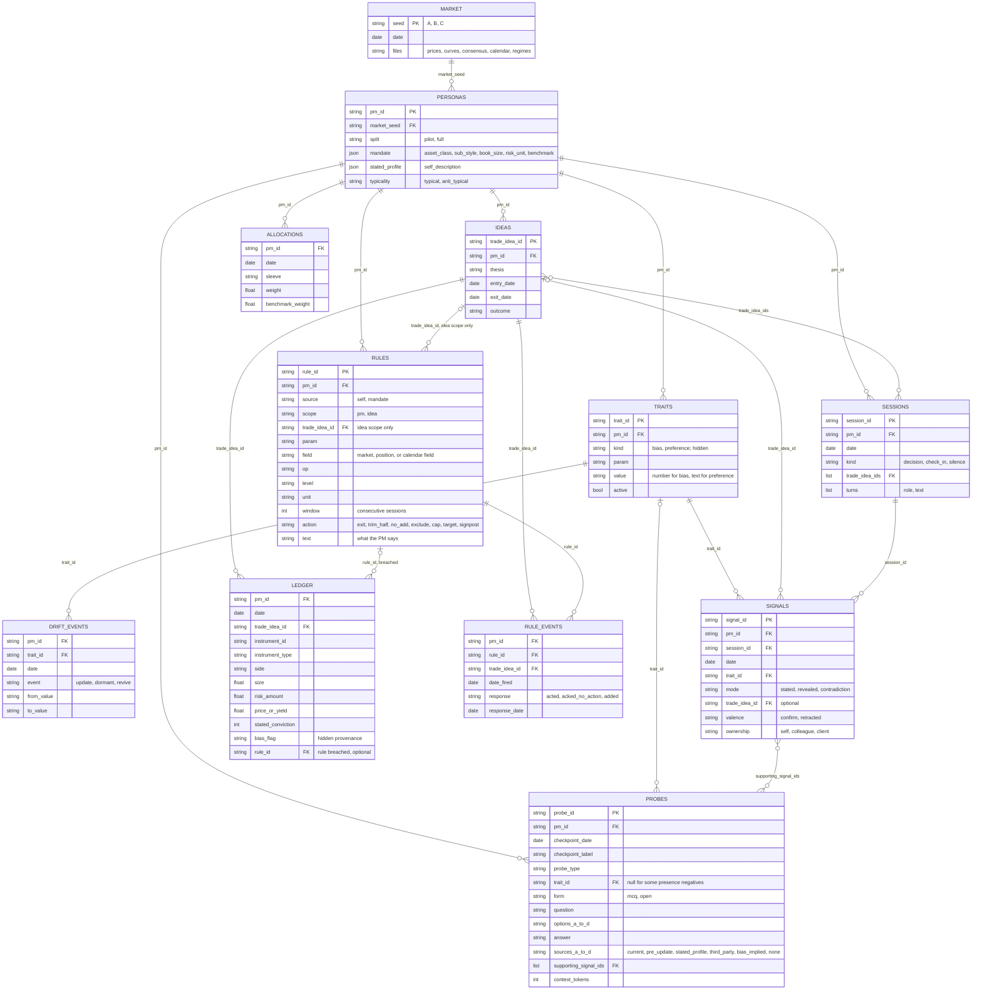

# Plan: PM-TraitBench, a synthetic PM behavioural trait dataset

**Status:** Draft build plan, 2026-09-15. Scope is data generation only: a frozen synthetic corpus of portfolio managers (PMs), their trade ledgers, their advisory conversations with a copilot, and probes with ground truth, for evaluating the copilot's behavioural memory. Ground truth covers two kinds of trait: biases, which are P&L-material breaches of the PM's own rules or of a rational baseline and which the copilot should counteract and call out, and preferences, which are not P&L-material and which the copilot should comply with and amplify. Both are planted as behavioural signals of one shape, so the dataset never tells the memory system which is which.

---

## 0. The one design rule

**Never let an LLM persona prompt generate the PM's trades.** Z. Li et al. (2026) show that of four planted biases only loss aversion expresses reliably under persona prompting; Yee and Koh (2026) show disposition lands ~87% short of the human benchmark even after calibration, and anchoring and representativeness pass adversarial probes only 5-18% of the time. A rule-based engine through the same harness hits significance on every driver.

So the pipeline is: **deterministic behaviour engine produces the ledger; the LLM only narrates dialogue around decisions already made.** This is the FinPerMA construction (B. Wang et al., 2026: deterministic impact model, constrained narrator, validator, frozen corpus) applied to trades instead of life events. Ground truth is a parameter vector and a ledger, never a sentence.

## 1. Ground truth schema (per PM)

```json
{
  "pm_id": "pm_017",
  "market_seed": "A",
  "split": "pilot",
  "mandate": {"asset_class": "rates_credit", "sub_style": "long_short_credit", "book_size": 400e6, "risk_unit": "dv01", "benchmark": "agg"},
  "stated_profile": {"self_description": "disciplined, process-driven, cuts losers fast"},
  "rules": [
    {"rule_id": "r_01", "source": "mandate", "scope": "pm",   "param": "max_risk_pct",          "field": "size_pct_book",   "op": "<=", "level": 10,   "unit": "pct", "window": 1, "action": "cap",       "text": "single position at most 10% of book"},
    {"rule_id": "r_02", "source": "self",    "scope": "pm",   "param": "stop_loss",             "field": "pnl_from_entry",  "op": "<=", "level": -15,  "unit": "pct", "window": 1, "action": "exit",      "text": "stop at -15% from entry"},
    {"rule_id": "r_03", "source": "self",    "scope": "pm",   "param": "trim_at_target",        "field": "target_hit",      "op": "==", "level": 1,    "unit": null,  "window": 1, "action": "trim_half", "text": "take half off at target"},
    {"rule_id": "r_04", "source": "self",    "scope": "pm",   "param": "no_add_before_trigger", "field": "triggers_fired",  "op": "==", "level": 0,    "unit": null,  "window": 1, "action": "no_add",    "text": "never add to a position until a signpost has fired"},
    {"rule_id": "r_05", "source": "self",    "scope": "pm",   "param": "sector_exclusion",      "field": "sector",          "op": "!=", "level": "energy", "unit": null, "window": 1, "action": "exclude", "text": "no single-name energy issuers"},
    {"rule_id": "r_31", "source": "self",    "scope": "idea", "trade_idea_id": "ti_031", "param": "stop",     "field": "spread_bp", "op": ">=", "level": 175, "unit": "bp", "window": 1, "action": "exit",     "text": "out if it goes through 175"},
    {"rule_id": "r_32", "source": "self",    "scope": "idea", "trade_idea_id": "ti_031", "param": "target",   "field": "spread_bp", "op": "<=", "level": 110, "unit": "bp", "window": 1, "action": "target",   "text": "target 110"},
    {"rule_id": "r_33", "source": "self",    "scope": "idea", "trade_idea_id": "ti_031", "param": "signpost", "field": "event",     "op": "==", "level": "rating_downgrade", "unit": null, "window": 1, "action": "signpost", "text": "a downgrade kills the thesis"},
    {"rule_id": "r_34", "source": "self",    "scope": "idea", "trade_idea_id": "ti_031", "param": "signpost", "field": "spread_bp", "op": ">",  "level": 160, "unit": "bp", "window": 5, "action": "signpost", "text": "if it sits wider than 160 for a week the tightening story is wrong"}
  ],
  "traits": [
    {"trait_id": "t_01", "kind": "bias", "param": "loss_aversion_lambda", "active": true,  "value": 2.6,  "mult_range": 1.0, "mult_risk_off": 1.31, "mult_risk_on": 1.0},
    {"trait_id": "t_02", "kind": "bias", "param": "disposition_ratio",    "active": true,  "value": 1.8},
    {"trait_id": "t_03", "kind": "bias", "param": "anchoring_rho",        "active": true,  "value": 0.55},
    {"trait_id": "t_04", "kind": "bias", "param": "extrapolation_theta",  "active": false, "value": 0.15},
    {"trait_id": "t_05", "kind": "bias", "param": "herding_weight",       "active": true,  "value": 0.45, "mult_range": 1.0, "mult_risk_off": 1.0, "mult_risk_on": 1.33},
    {"trait_id": "t_06", "kind": "bias", "param": "overconfidence_coverage",        "active": false, "value": 0.78},
    {"trait_id": "t_07", "kind": "bias", "param": "conviction_size_miscalibration", "active": false, "value": 0.12},
    {"trait_id": "t_08", "kind": "bias", "param": "exit_deficiency",      "active": false, "value": 0.05},
    {"trait_id": "t_09", "kind": "preference", "param": "response_format",      "active": true, "value": "three lines max, number first"},
    {"trait_id": "t_10", "kind": "preference", "param": "positioning_context",  "active": true, "value": "mention street positioning on every idea"},
    {"trait_id": "t_11", "kind": "preference", "param": "duration_expression",  "active": true, "value": "steepeners over outright duration"},
    {"trait_id": "t_12", "kind": "preference", "param": "pushback_style",       "active": true, "value": "blunt, numbers first"}
  ],
  "typicality": "anti_typical",
  "drift_schedule": [
    {"date": "2026-06-01", "event": "update",  "trait_id": "t_02", "from": 1.8, "to": 1.1},
    {"date": "2026-07-27", "event": "update",  "trait_id": "t_09", "from": "three lines max, number first", "to": "short paragraph, number first, one named risk"},
    {"date": "2026-08-31", "event": "dormant",   "trait_id": "t_05"},
    {"date": "2026-11-02", "event": "revive",    "trait_id": "t_05"}
  ]
}
```

Notes:
- Two objects carry behaviour. `rules` are every commitment the PM is held to, in one list: P&L-material, never breached by design, and the reference against which biases are observed. `source` says who set the rule (`mandate` from outside, `self` from the PM); `scope` says where it applies (`pm` for every idea, `idea` for one). From the system's point of view they are equally binding, so they share one table. `mandate` keeps only descriptive facts (asset class, sub-style, book size, risk unit, benchmark). `traits` are what the memory system must learn: biases and preferences.
- The test that decides `kind` is materiality: if satisfying the item would move expected P&L or risk, it is a rule (when the PM commits to it) or a bias (when the PM systematically breaches a rule or a rational baseline); if not, it is a preference. "Stop at -15%" is a rule; "did not stop at -15%" is a bias signal; "steepeners over outright" and "blunt, numbers-first pushback" are preferences. Because of this test the copilot's expected action follows from `kind` alone: counteract a bias, comply with a preference, and decline any request that breaches a `mandate`-sourced rule. No per-trait action field is needed.
- Every trait has the same fields: `trait_id`, `kind`, `param`, `value`, `active`. `value` is numeric for a bias and text for a preference. The only kind-specific fields are the three regime multipliers on biases, `mult_range`, `mult_risk_off`, `mult_risk_on` (1.0 where no cluster is planted, null on preferences); multipliers rather than absolute values so a drift update of the base value does not make them stale. Signals, probes, and drift events reference `trait_id` only, so nothing the memory system reads says whether a trait is a bias or a preference. `active: false` occurs only on biases, which are listed whether active or not; preferences are listed only when the PM has them. This nested object is the conceptual schema; in storage (section 8) `personas.jsonl` holds the PM-level fields and `rules`, `traits`, and `drift_schedule` live once each in `rules.jsonl`, `traits.jsonl`, and `drift_events.jsonl`. Idea-scope rules are shown for one idea here; the full set is in `rules.jsonl`, not repeated on `ideas.jsonl`.
- A rule is a condition plus an action, and the condition is machine-evaluable: `field` (a market field of the idea's instrument such as `spread_bp` or `price`, a position field such as `pnl_from_entry`, `size_pct_book`, `triggers_fired`, or `sector`, or a calendar `event`), `op`, `level`, `unit`, and `window` (consecutive sessions the condition must hold). `action` is what honouring the rule means: `exit`, `trim_half`, `no_add`, `exclude`, `cap`, `target`, `signpost`. `text` is the phrasing the PM uses in sessions; the narrator sees only `text`. Idea-scope rules are the stated stop, the stated target, and the signposts (the conditions that would invalidate the thesis), each a row with `trade_idea_id`. Every rule with a market condition is a trigger: the engine evaluates triggers daily, logs each firing in `rule_events.jsonl` with the PM's response, and that log is how "adds to a loser before any trigger fired" and "acknowledges two fired signposts without acting" become ledger fingerprints (section 3).
- Bias traits: the first six parameters are taken from the eight canonical parameters Yee and Koh (2026) test with published human benchmarks (their representativeness and probability weighting are left out, the first because it needs narrative-versus-fundamental information the market layer does not carry, the second because it has no ledger fingerprint in a directional book); the last three (conviction-size miscalibration, exit deficiency, regime cluster) are the copilot's own vocabulary, taken from the consolidation prompt guidance in the copilot proposal, and need engine rules but no external benchmark. The split of traits into biases and preferences by materiality is a design choice of this plan, not a taxonomy from the literature. All eight appear on every PM, active or not, so Gate 1 has every value the engine used. Inactive biases (value drawn from the neutral distribution) form the forbidden set the validator checks in section 4. Values are sampled per section 1.1.
- Preference traits are sampled from the catalogue in section 1.2. They have no numeric magnitude; `value` is the thing the copilot must remember and act on. Whether a given preference is expressed by statement or by revealed reaction is decided per signal in the signal plan (section 4), not per trait.
- `stated_profile` is what the PM says about themselves in aggregate. `typicality: anti_typical` means the self-description contradicts the PM's strongest active biases. B. Wang et al. (2026) and Jiang et al. (2025b) both find this the hardest bucket (4.5-11 point and 16 point drops), so it must be a labelled slice: 50% of the PMs within each asset-class bucket. Typicality is about biases; preferences are never planted to contradict the profile.
- `drift_schedule` is what makes invalidation measurable. Three event types: update (`from` and `to`; on a bias this is attenuation after coaching, on a preference it is replacement, and `kind` says which), dormant (a bias stops expressing, value unchanged), and revive. The old value after an update becomes a probe distractor, which is the core PersonaMem case. Event dates are sampled per PM within windows (bias update in weeks 18-30, preference update 8-45, dormant 32-40, revive 42-48), never fixed, so drift never coincides with a regime boundary for the whole population.
- `market_seed` assigns the PM to one of the three regime orderings in section 2. Each asset-class bucket is spread evenly across the three seeds.
- Regime names follow the market layer: `range`, `risk_off`, `risk_on` (the bear and bull of the sources). Clusters are planted per active bias with probability `p_regime_cluster` under a fixed mapping: loss aversion and disposition cluster in `risk_off`, extrapolation and herding in `risk_on`, anchoring in `range`; overconfidence, conviction-size miscalibration and exit deficiency never cluster.
- `mandate.asset_class` is one of `equities`, `rates_credit`, `commodities`, `multi_asset`. Split evenly across PMs: 25% each. Sub-styles within each (equity long/short, long-only equity, sovereign rates, credit long/short, commodity futures directional, curve and spread, global macro multi-asset, balanced allocation) so that the behaviour graph's vocabulary can stay demand-driven per PM: a commodity PM's graph should never grow an equity-only hub.

### 1.1 Parameter distributions

This section covers bias traits only; preference traits are categorical and come from section 1.2. Normal is wrong for every marginal: most parameters are bounded or strictly positive, the empirical populations are skewed, and no real PM carries every bias. The sampling scheme has three layers.

**Layer 1: sparsity.** Each bias parameter is active for a PM with probability `p_active`; inactive parameters draw from a narrow neutral distribution. `p_active = 0.35` is a **design choice** (about 2-4 active biases per PM). The one empirical anchor is Dhar and Zhu (2006): roughly 20% of retail investors show a reverse disposition effect, so a population where everyone carries every bias is wrong, but no study gives the joint activation rate across biases.

**Layer 2: correlated latent.** Draw `z ~ MVN(0, R)` per PM and map each component through its marginal quantile function (Gaussian copula). The correlation matrix `R` uses the cross-parameter correlations Yee and Koh (2026, Table 3) recover at the agent level (N = 2,400): lambda vs disposition ratio +0.42; overconfidence vs herding -0.31; lambda vs herding -0.08; extrapolation vs herding +0.05; anchoring vs everything |rho| < 0.12, set to 0. Pairs not reported there are set to 0 (**design choice**). Two pairs are a **guess** with no source, both on exit deficiency. Exit deficiency vs disposition ratio is +0.30. The sign rests on a shared mechanism: both come from reluctance to realise a loss, a stop only fires on a losing position, which is the one a high-disposition PM least wants to sell, and Shefrin and Statman (1985) describe the stop-loss as a self-control device against the disposition effect. The size is kept moderate and below the sourced +0.42 because the target side pulls the other way (a PM who sells winners early honours trim-at-target rules more, not less) and because signposts are also ignored for reasons unrelated to disposition; anything from 0.2 to 0.4 is defensible. Exit deficiency vs lambda is +0.126, the product of +0.30 and +0.42, which makes the two conditionally independent given disposition; a zero there would imply that among PMs with the same disposition the more loss-averse ones breach their exit rules less. Conviction-size miscalibration is left uncorrelated with every other parameter: whether sizing tracks stated conviction is close to orthogonal to whether beliefs are calibrated, and no direction had support. Activation is drawn independently per bias, so a pair only acts on the roughly 1 PM in 7 where both are active; a wrong size matters little, a wrong sign more.

**Layer 3: marginals.** Family follows the support (Beta on [0,1], LogNormal on positive ratios). The centre and range of each active distribution is sourced where a source exists; the neutral distribution, the floors, and the spread are design choices unless marked otherwise.

| Parameter | Meaning | Support | Neutral (inactive) | Active | Basis for the active centre and range |
|---|---|---|---|---|---|
| loss_aversion_lambda | How much more a loss hurts than an equal gain pleases; drives adding to losers rather than cutting. | > 0 | LogNormal median 1.1, sigma 0.10 (guess) | LogNormal median 2.0, sigma 0.25, floor 1.5 | Brown et al. (2024) meta-analysis, 607 estimates: mean 1.955, 95% CI [1.820, 2.102]. Tversky and Kahneman (1992) 2.25; Novemsky and Kahneman (2005) domain range 1.8-2.7. Sigma 0.25 puts the central 90% at roughly 1.3-3.0, matching the Novemsky-Kahneman span; sigma itself is a **guess** because Brown et al. report the CI of the mean, not the dispersion of estimates. |
| disposition_ratio (PGR/PLR) | Tendency to sell winners and hold losers: proportion of gains realised divided by proportion of losses realised; 1 = no bias. | > 0 | LogNormal median 1.0, sigma 0.08 (guess) | LogNormal median 1.5 (retail) or 1.2 (professional), sigma 0.15, floor 1.2 | Odean (1998): PGR 0.148, PLR 0.098, ratio 1.51. Yee and Koh (2026, App. A.1) literature range [1.30, 2.00]. Frazzini (2006): average mutual fund about 20% more likely to realise gains than losses, so a professional centre near 1.2. Locke and Mann (2005): professional futures traders also hold losers longer. Use the professional centre for PMs; the retail centre is the sensitivity variant. |
| anchoring_rho | How strongly an exit or valuation is pulled toward a reference number (entry price, target, round level) instead of the current view. | [0, 1] | Beta(2, 12), mean 0.14 (guess) | Beta(9, 12), mean 0.43, central mass 0.30-0.55 | Northcraft and Neale (1987): corr(valuation, anchor) 0.41 for experts, 0.48 for novices. Mussweiler et al.: 0.38-0.52 by expertise. Yee and Koh (2026, App. A.6) benchmark 0.43, range [0.38, 0.52]; experts 0.35-0.45. Beta parameters chosen to centre on 0.43 with that range as roughly the interquartile spread. |
| extrapolation_theta | Weight placed on recent returns when forming expected returns; drives buying after runs and selling after drops. | [0, 1] | Beta(2, 10), mean 0.17 (guess) | Beta(12, 8), mean 0.60, central mass 0.50-0.70 | Bloomfield and Hales (2002): corr(forecast, past return) 0.63. Greenwood and Shleifer (2014): 0.57 from survey expectations. Yee and Koh (2026, App. A.7) benchmark 0.60, range [0.55, 0.65]. Cassella and Gulen (2018) show the population degree of extrapolation varies a lot over time, which is why a per-PM spread wider than [0.55, 0.65] is used. |
| herding_weight | Weight placed on consensus or crowd positioning versus the PM's own signal when deciding a trade. | [0, 1] | Beta(2, 10), mean 0.17 (guess) | Beta(7, 5), mean 0.58, central mass 0.45-0.72 | Anderson and Holt (1997): 68% follow the crowd when the private signal conflicts. Celen and Kariv: 74%. Yee and Koh (2026, App. A.3) benchmark 0.70, range [0.65, 0.75], noting pure Bayesian herding would be about 30%. These are lab cascade rates for retail-like subjects. For fund managers only the LSV measure exists (Wermers 1999: 3.4%; Lakonishok et al. 1992: 2.7%), which is a different quantity and cannot be converted to a weight, so the professional centre is pulled down to 0.58 as a **guess**. |
| overconfidence_coverage | Realised hit rate of the PM's stated 80% confidence interval; low value = intervals too narrow, sizing too aggressive for the stated uncertainty. | [0, 1], lower = more overconfident; defined as hit rate of a stated 80% interval | Beta(16, 4), mean 0.80 (calibrated by definition) | Beta(4, 6), mean 0.40, central mass 0.25-0.55 | Ben-David, Graham and Harvey (2013): CFO 80% intervals for S&P 500 returns contained the realised return 36% of the time over 13,300 forecasts. Moore and Healy (2008) meta-analysis: stated 80% intervals contain the outcome about 65% of the time in general populations (Yee and Koh 2026, App. A.2). Russo and Schoemaker (1992): managers' 90% intervals hit 30-60%. Professionals forecasting markets are worse than the general population, so the centre uses Ben-David et al. and the upper tail reaches the Moore-Healy value. |
| conviction_size_miscalibration | Gap between stated conviction and actual position size; 0 = sizes track conviction rank, 1 = no relation. | [0, 1], 1 minus rank correlation between stated conviction and position size | Beta(2, 10) (guess) | Beta(5, 5), mean 0.5 (guess) | **No source.** Cohen, Polk and Silli (2010) show managers' highest-conviction "best ideas" outperform, which motivates the parameter but does not measure the size-conviction gap. Treat as design choice; Gate 1 sets the floor. |
| exit_deficiency | Probability that the PM breaches their own stated stop or trim rule when it triggers. | [0, 1], probability of not honouring own stated stop or trim | Beta(1, 15), mean 0.06 (guess) | Beta(4, 5), mean 0.44 (guess) | **Direction sourced, magnitude not.** Akepanidtaworn et al. (2023): institutional PMs (average portfolio 573m) show skill buying but selling decisions underperform even random selling. Essentia Analytics Alpha Lifecycle: most long-only managers hold positions past the alpha peak; closed positions contributed -4.7% alpha on average. Neither gives a rule-breach rate. |
| regime multiplier (`mult_range`, `mult_risk_off`, `mult_risk_on`) | Factor by which an active parameter strengthens inside a named market regime. | > 0, multiplies the active parameter inside the named regime | 1.0 | LogNormal median 1.15, sigma 0.10, range 1.0-1.5 | Guiso, Sapienza and Zingales (2018): quantitative risk aversion rose from 2.87 to 3.28 (x1.14) after the 2008 crash; the share refusing any financial risk went from 16% to 43%. Only loss-aversion-type parameters have this source; applying the same multiplier to herding or extrapolation in bull regimes is a **guess**. |
| bias update `to` / `from` | Fraction of the parameter value that remains after a coaching-style update event on a bias. | (0, 1] | n/a | Uniform(0.5, 0.75) | Feng and Seasholes (2005): sophistication plus experience reduce the propensity to realise gains by 37% and eliminate the reluctance to realise losses. Cici (2012): learning effects reduced the disposition effect in mutual funds over time. A coaching event is modelled as the Feng-Seasholes gains-side effect (x0.63) with a spread; the losses-side "eliminated" result is the lower bound. Transfer to non-disposition parameters is a **guess**. |
| book_size | Capital the PM manages, in currency units; scales position sizes. | > 0 | LogUniform 50m to 2bn | same | **Guess.** Hedge fund AUM is heavy-tailed (HFR 2025: industry 4.98tn concentrated in managers above 5bn; Preqin 2025) but no public median fund size was found. Akepanidtaworn et al.'s 573m average is the one PM-level datum. |
| max_risk_pct | Mandate-sourced rule: cap on a single position as a share of book, in the mandate's risk unit. | discrete | choice {5, 8, 10, 15}% | same | **Guess**, conventional single-position limits. |
| p_active | Probability that any given bias parameter is active (planted) for a PM. | [0, 1] | 0.35 | | **Guess**, see Layer 1. |

Rules for using the table:
- Every "guess" cell is a parameter of the generator, logged in `README.md`, and a candidate for sensitivity analysis. Nothing else in this document should be read as sourced unless the basis column names a source.
- Retail benchmarks (Odean, Tversky and Kahneman, Anderson and Holt) are stronger than professional ones. Where a professional value exists (Frazzini, Ben-David et al., Locke and Mann, Akepanidtaworn et al.) it sets the centre; where it does not, the retail value is used and flagged.
- Floors on the active distributions are provisional. Gate 1 replaces them: run the ledger estimator on neutral PMs, take its standard error per parameter per asset class, and set the active floor at two standard errors above the neutral mean. A floor below that makes the active label unrecoverable and the parameter should be re-centred or dropped.
- Typicality is not sampled. The self-description is written to agree with the PM's two strongest active parameters (typical) or to contradict them (anti-typical).

### 1.2 Preference catalogue

Preferences are sampled from a fixed catalogue so that every value has a known way to express and a known way to score. An item enters the catalogue only if it passes the materiality test in section 1: satisfying it must not move expected P&L or risk. Anything that would is a rule or a bias and is handled elsewhere. The catalogue groups params four ways for sampling and scoring; the grouping is a design choice with no external source, and the group is a property of the catalogue entry, not a field on the trait:

| Group | Example params | Where it expresses | How compliance is scored |
|---|---|---|---|
| communication | response_format (length, bullets vs prose, number first), pushback_style (blunt, hedged), register (no jargon), language of numbers (bp vs %) | PM reactions to advisor turns, stated in check-ins | automatic: line count, first-token type, banned-word list on the copilot's answer |
| information | positioning_context, always show carry, never macro commentary, cite the calendar | what the PM asks for or complains is missing | rubric: required element present, banned element absent |
| workflow | pre_mortem before sizing, reminder before roll or refi windows, weekly exposure recap on Mondays | what the PM asks the copilot to do or to stop doing | rubric: action offered or performed at the right moment |
| expression | duration_expression (steepeners over outright), hedge_instrument (index over single name), futures over ETF | ledger (instrument choice within mandate, planted as an engine weight) and stated in sessions | ledger share of the preferred expression; rubric for advice that proposes it |

Sampling per PM (all **guesses**, logged in the README):
- 4-8 preferences per PM, at least one from each group.
- Updates: half of drift PMs get one `update` event on a preference, with the old value kept as a probe distractor.

Catalogue size about 30 params with 2-4 values each; asset-class-specific params (roll reminders for commodities, refi windows for credit, rebalance recaps for multi-asset, curve vs outright expression for rates) follow the expression adapters in section 3.

### 1.3 Rule catalogue and sampling

Rules are sampled after mandate and traits, from a catalogue keyed by asset class, because levels are expressed in the mandate's risk unit. Each PM gets the mandate cap plus 3-5 self rules (**guess**), at least one exit rule (stop) and one discipline rule (no add before trigger, or a minimum holding period). All level ranges below are **guesses**, logged in the README.

| PM-scope rule (param) | Equities | Rates and credit | Commodities | Multi-asset | Share of PMs |
|---|---|---|---|---|---|
| stop_loss | -10 to -20% from entry | +15 to +30bp yield, or +25 to +50bp spread, adverse | -8 to -15% from entry | sleeve drawdown -3 to -6% | 100% |
| trim_at_target | take half or all at target | same | same | rebalance to band at target | 70% |
| no_add_before_trigger | true | true | true | true | 60% |
| min_holding_period | 5 to 20 sessions | 10 to 30 | 5 to 15 | one rebalance cycle | 40% |
| sector_exclusion or instrument exclusion | one sector | one rating band or sector | one commodity group | one sleeve or region | 40% |
| max_positions | 15 to 40 names | 10 to 25 issuers or curves | 8 to 20 contracts | fixed sleeve list | 50% |

Idea-scope rules are written by the engine at entry, from the PM-scope rules and the instrument:
- `stop` and `target`: the PM's stop rule applied to the entry level, and a target set at 1.5-3x the stop distance (**guess**) in the same unit, so risk-reward is stated on every idea. Both are scaled by the instrument's trailing volatility so a quiet name gets a tighter stop than a volatile one.
- `signposts`: 2-3 per idea, drawn from an asset-class signpost catalogue: a calendar event for the name or issuer (earnings, guidance, auction, inventory report), a level breach held for a window (price, spread, or yield through a level for 3-5 sessions), and a relative move (versus sector, curve, or benchmark). Levels are set relative to entry and scaled by volatility, so signposts fire on a planted share of ideas (a stage 2 knob).
- `text` for every rule comes from the template bank, phrased per asset class.

Order within stage 1: mandate, then bias traits (section 1.1), then preferences (section 1.2), then rules (this section), then self-description (typicality needs the two strongest active biases), then drift events.

## 2. Market layer

Two kinds of market seed share one universe, one table layout and one calendar axis. Synthetic seeds (A, B, C) simulate paths whose drift, volatility, tail, and correlation targets are set from published ranges per asset class (listed in config as sourced or guessed, like every other generator setting). Real seeds (R1, and any further seed added under `market.real.seeds`) replay a window of actual history, disguised: each series keeps its historical day-over-day change and only its starting level is rebased onto the synthetic ranges, instrument ids are a fixed anonymised registry (`EQ-R001`, never a ticker), and every date is remapped onto the simulated calendar axis. The pilot runs on R1 (window from 2018-06-04, regimes range, risk-off, risk-on starting 2018-06-04, 2018-10-01 and 2018-12-26); the full split's `population.market_seeds` can point at synthetic seeds, real seeds, or both. Yee and Koh (2026) show a classifier cannot tell their synthetic paths from real ones; no such realism test is planned here, since nothing in the evaluation depends on it. Reasons for keeping synthetic seeds: no memorised outcomes for the narrator or the evaluated system to lean on, and regimes can be scripted. Reason for a real pilot seed: the return pattern is history, so the engine and the gates are not conditional on the synthetic model's guessed magnitudes. The disguise hides levels, names and dates, not the return pattern itself; the real window is recorded in the run metadata and the config for operators only and is never passed to a model under test.

One shared market, 52 weeks of daily data (every weekday, one close per instrument per day, no holidays or intraday), five instrument families so that every mandate has something to trade and multi-asset PMs trade across all of them. Every tradeable thing is an instrument with one `instrument_id`, including sovereign curves, so consensus, calendar rows and signposts key on one id for every family:

- **Equities:** 80 abstract names (`EQ-0001`) on a synthetic seed, 40 US large caps (`EQ-R001..EQ-R040`, four per sector, beta fitted on SPY, adjusted closes rebased to a random start in the configured range) on a real seed, with sector tags and a beta. One common risk driver `z` plus idiosyncratic Student-t noise; no sector factor (no bias fingerprint measures sector co-movement, and its vol could not be sourced), so the sector tag is a static attribute for exclusion rules only. Consensus is the street score and view per name.
- **Rates:** sovereign curves as instruments (`RT-USD`, `RT-EUR`, `RT-GBP`, `RT-JPY`; `kind = sovereign_curve`, no `prices` row) with tenors `2Y, 5Y, 10Y, 30Y` in `curves`, driven by a two-factor level and slope model with level vol per currency and yields floored at zero. On a real seed only the USD curve is real (FRED constant-maturity yields, one additive shift so the 10Y starts at the configured level). Anchors = round yield levels, entry yield, prior cycle highs.
- **Credit:** abstract issuers (`CR-IG-001`, `CR-HY-001`) with a static rating band, duration and sector, a spread series in `prices.spread_bp` and a bond price derived from the spread and the currency's 5Y yield. One market-wide credit factor with asymmetric shocks (widening scaled up, tightening scaled down) times a rating-band base times mean-reverting issuer noise; no defaults, no rating migration. On a real seed credit is investment-grade only: two index-level proxies (`CR-R-IG-001` from Moody's Aaa and `CR-R-IG-002` from Baa seasoned yields minus the 20Y Treasury, bands AA and BBB, duration a 13-year guess), no high-yield tier, no issuer noise. Anchors = entry spread, round spread levels.
- **Commodities:** one instrument per commodity (`CM-<code>`, generic real names such as crude and gold, natural gas excluded), not one per contract month. `prices.price` is the front month; the futures curve `M1..M12` lives in `curves` as spot times a scripted shape with a fixed roll yield per group; expiry follows a monthly rule stored on the instrument, and the engine derives `days_to_expiry` from the rule and the date. On a real seed the 15 commodities are Yahoo continuous front months (no natural gas): M2-M12 are scripted from the real M1 with the synthetic slopes and no noise, and the continuous M1 series rolls at the source's own dates, not at the calendar's third-Friday expiry rows. Anchors = entry price, prior contract high, round levels.
- **FX:** pairs (`FX-EURUSD`) derived from one zero-drift log value per currency against USD, so crosses are consistent by construction; on a real seed the six USD pairs come from FRED H.10 rates and the three crosses are derived the same way. Needed as the cross-asset hedge and as multi-asset expression.

Abstract ids for equities and credit because single names carry memorable stories; real generic names for commodities and currencies because a PM cannot talk about "curve 3" or "pair 7", and a unit is not a story.

Synthetic seeds share every idiosyncratic and driver draw; seed-specific draws are only event surprises and consensus flip dates, so regime order is the only structural difference between A, B and C. Each PM is assigned to one seed. This breaks the confound between a scheduled drift event and a regime boundary: if every PM saw risk-off end at week 30, a bias going quiet at week 30 could be coaching or could be the regime.

| Seed | 2026-01-05 to 2026-04-26 (weeks 1-16) | 2026-04-27 to 2026-08-02 (weeks 17-30) | 2026-08-03 to 2027-01-03 (weeks 31-52) |
|---|---|---|---|
| A | range | risk-off | risk-on |
| B | risk-on | range | risk-off |
| C | risk-off | risk-on | range |

Week 1 starts Monday 2026-01-05. Week numbers in this plan are shorthand; every file stores dates, and `market/regimes.jsonl` holds `seed, regime, date_start, date_end` so nothing downstream needs the week anchor.

A regime is two numbers on the common driver, `driver_mean` and `vol_multiplier`, plus a round-level pull that is non-zero only in range. Every family's drift per regime follows from its correlation with the driver, so no drift is a config field: risk-off = equities down, rates rally, credit widens, gold up, energy down; risk-on = the reverse with equities and energy leading; range = low-drift, mean-reverting, round-number levels tested repeatedly (this is where anchoring expresses). Volatility is constant within a regime span (no clustering on top of the switch). Co-movement across families follows the regime; within-family dispersion stays so single-name and single-issuer trades still differ. A real seed carries the same three regime labels over its scripted date spans, but its moments are whatever history did; its driver `z` is SPY's daily return divided by its sd over the axis, so consensus and the reported correlations have the same reference as a synthetic seed.

Every PM sees all three regimes for a comparable duration, so regime multipliers have something to cluster on in each regime, and multi-asset PMs face allocation decisions in every seed. Regime boundaries are visible in `market/regimes.jsonl` and are ground truth for regime-cluster probes.

Burn-in: 60 trading days before the calendar start with the first regime's parameters and no events, rows dropped, so day one already has lagged history behind prices, street score and positioning.

Event calendar: one sampled event class per instrument (earnings for equities, rating upgrades and downgrades for credit issuers, central-bank meetings for curves, inventory reports for energy, crop reports for agriculture; industrial metals, precious metals and FX carry none) plus a market-wide macro print tied to no family that adds directly to the driver. There are no guidance, auction or OPEC events: a disappointing result is an `earnings` row with a large negative surprise. Events are inputs to the price process, not decoration: each row carries a signed `surprise` in [-1, 1] and the price effect is `surprise x jump_size[event]`; one-sided events carry the sign in the label. Every dated mechanism appears in `calendar.jsonl`, including the deterministic `contract_expiry` and weekly `positioning_report` rows and the `consensus_flip` rows the consensus module writes; only regime boundaries stay in `regimes.jsonl`. On a real seed nothing is sampled: event dates are public schedules (FOMC for the curve, WASDE for agriculture, the BLS Employment Situation as the macro print, the EIA weekly petroleum report on every Wednesday for energy, shifted to the next trading day when the series has no close) and, for earnings, each real equity's SEC EDGAR 8-K filings with Item 2.02 (Results of Operations), fetched with a declared User-Agent (`market.real.sec_user_agent`); a filing accepted from 16:00 New York time counts on the next trading day, and off-cycle 2.02 filings count as earnings too. Rating actions do not exist on a real seed. A real surprise is `tanh(move / (3 x sd))`, where `move` is the series' own daily move on the event date (the 10Y yield change with the sign flipped for the curve, the commodity's log return, SPY's return for the macro print, and for earnings the equity's abnormal return, its own move net of beta times SPY's) and `sd` is that series' daily sd over the seed's full axis, so a 1-sd day scores about 0.32, outliers keep their ranking and the value never reaches plus or minus 1. No consensus-versus-actual figure enters, since EDGAR carries none. The engine's signpost catalogue keys on the event types present in the seed's calendar, not on the family alone, so a rule keyed to `rating_downgrade` never exists on a real seed and one keyed to `crop_report` never exists for a metal. Feeds narrator content and the simulated advisor's factual answers.

Consensus and positioning: per instrument, a trailing 20-day trend (sign flipped for yields and spreads, where falling is bullish) drives an exponential moving average `street_score` in [-1, 1] with a 20-trading-day half-life, updated only on the instrument's event days, one weekly revision day and flip days, and held otherwise, so the series steps. A flip sets the score to the opposite view past the label boundary with no price move to justify it, twice per instrument per year, and is dated in the calendar; that is the herding trap. `street_view` is the label at plus or minus 0.25. `positioning_pct` in [0, 100] moves toward a saturating map of the 60-day trend on each Friday report date with a 60-trading-day half-life; `positioning` labels crowded below 20 and above 80. Rows are written daily for every instrument with consensus, so no consumer forward-fills. Credit is the one family with no public positioning series to check against, so its score is a survey analogue.

## 3. Behaviour engine (ledger generator)

Per PM, per trading day. Idea lifecycle: thesis, entry, sizing, monitoring, exit. Every decision is a function of state, the PM's rules, and the PM's bias traits, with a documented rule per parameter. The rule is parameter-level and the same across mandates; what changes per asset class is the **expression**: the instrument, the risk unit, the anchor, and the consensus source. One engine, one rule table, four expression adapters.

| Parameter | Rule | Ledger fingerprint (breach of which reference) |
|---|---|---|
| loss_aversion_lambda | Utility of adding to a loser vs cutting; higher lambda adds | add-to-loser rate, including adds before any trigger has fired (breach of the no-add rule) |
| disposition_ratio | Probability of selling given a gain divided by probability of selling given a loss (PGR/PLR after Odean, 1998) | realised gain vs loss frequency |
| anchoring_rho | Exit target regressed toward entry price or sell-side target | correlation of exits with anchor |
| extrapolation_theta | Weight on trailing return in expected-return forecast | entries after runs |
| herding_weight | Weight on consensus view vs own signal | entries co-moving with consensus changes |
| overconfidence_coverage | Width of stated price interval; sizing relative to it | interval hit rate |
| conviction_size_miscalibration | Position size vs stated conviction rank | rank correlation size vs conviction |
| exit_deficiency | Probability of not honouring a rule when it triggers | breach rate across `rule_events.jsonl` (stop hit, target hit, signpost fired), including acknowledging a trigger without acting |

Rules enter the engine as the reference the biases are measured against. PM-scope rules constrain every idea (the stop and trim rules set each idea's stop and target rows; exclusions remove instruments from the universe; the mandate cap bounds size). Idea-scope rules are the stop, the target, and the signposts, the conditions that would invalidate the thesis (a spread through a level, a guidance cut, a curve move), each written as `field, op, level, window` against the market layer. Any rule with a market condition is a trigger. The engine evaluates triggers daily by reading the field from `market/` for the idea's instrument and checking the condition over the window, logs each firing in `rule_events.jsonl`, and then applies the PM's bias parameters to decide the response: act, acknowledge without acting, or add. A PM with neutral parameters honours every rule; a PM with active exit deficiency or loss aversion breaches them at the planted rate. When two rules disagree on the same day the engine resolves it by a fixed precedence on the action, not by a per-rule priority: exclusions and the mandate cap first, then exits (stop, signpost), then rolls, then trims at target, then holds. So a stop that fires inside a minimum holding period is honoured, and the hold rule is logged in `rule_events.jsonl` as overridden, not as breached; counting it as a breach would inflate the measured `exit_deficiency` of every PM who has both rules and Gate 1 would see a bias nobody planted. The same ordering settles a roll or a trim that falls inside a minimum holding period. When an override happens the PM says so in the session, so the ledger and the transcript agree. The engine spec carries the full table of conflicting pairs. Expression preferences (steepeners over outright, index over single name) enter as instrument-choice weights within mandate; their fingerprint is the share of ideas using the preferred expression, which Gate 1 also checks.

Expression adapters, one per asset class:

| | Equities | Rates and credit | Commodities | Multi-asset |
|---|---|---|---|---|
| Instrument | single name, sector basket | outright duration, curve steepener/flattener, single-issuer credit, index CDS | outright futures, calendar spread, inter-commodity spread | sleeves across the other three plus FX; allocation weights |
| Risk unit | notional, % NAV | DV01, spread DV01 | contracts, % NAV at margin | % NAV per sleeve, ex-ante vol contribution |
| Loss reference (lambda, disposition) | entry price | entry yield or spread | entry price of the specific contract, roll-adjusted | sleeve P&L since allocation change |
| Anchor (anchoring_rho) | entry, sell-side target | issue yield, "10y at 4%" round levels, prior cycle high | prior contract high, cost of production, round numbers | last rebalance weights, strategic benchmark weights |
| Consensus (herding) | analyst rating, crowded-position list | street forecasts, dealer positioning survey | positioning percentile, house view | asset-allocation consensus survey |
| Trend input (extrapolation) | trailing 1-3m return | trailing yield change, spread momentum | trailing move plus curve shape | trailing sleeve returns |
| Exit rule (exit_deficiency) | price stop, target trim | yield or spread stop, roll-down target | price stop, roll-before-expiry rule | rebalance band, drawdown trigger |
| Asset-class-specific bias | style drift (value to growth) | duration creep, carry chasing into rich credit | roll-yield neglect, curve-anchored exits | home-market overweight, rebalancing inertia |

The last row adds one parameter per mandate that only that mandate's PMs can carry. These are what should surface as mandate-specific hubs in the behaviour graph and are the concrete test of the demand-driven-vocabulary claim.

### 3.1 From parameter value to engine rule

Each bias parameter is drawn per PM from its section 1.1 marginal, then enters the daily loop through one decision. The table states the formula, whether that formula is the source's own definition or a construction in the spirit of the source, and the statistic Gate 1 uses to get the value back. "Definition" means the engine quantity is the same quantity the source measured, so the planted number and the literature number are on the same scale. "Spirit" means the engine uses the number as a mechanism weight while the source reported a correlation or a rate, so the scales differ and the value is calibrated through the engine (below).

| Parameter | Decision it enters | Engine formula | Basis | Gate 1 statistic |
|---|---|---|---|---|
| loss_aversion_lambda | what to do with an open idea at a loss when no trigger has fired: cut, hold, add | Actions are valued with a prospect-theory value function with the entry as reference point: gains count at face value, losses at lambda times face value. Cutting realises a sure loss valued at minus lambda times the loss; holding or adding keeps a gamble on the PM's own return forecast. The action is drawn by softmax over the three values with a fixed temperature. Higher lambda makes the sure loss worse than the gamble, so hold and add win more often. | Definition for the value function (Tversky and Kahneman, 1992; linear, no curvature). The action set, the softmax, and the temperature are design choices. | add-to-loser rate and hold rate on `position_days` rows with `pnl_state = loss` and `trigger_pending = false` (the engine excludes force-roll days from these opportunities) |
| disposition_ratio | daily sell decision for each open position with no trigger pending | A base sell hazard comes from thesis progress. It is multiplied by sqrt(D) when the position is at a gain and divided by sqrt(D) when at a loss, so the ratio of sell propensities is D and total turnover is unchanged. | Definition (Odean, 1998): PGR over PLR is the ratio of sell propensities on gains and losses, which is what the engine plants. | Odean PGR over PLR on `position_days` rows dated on days the PM sold anything; the engine reports the count of such rows per PM as `sell_day_position_days` |
| anchoring_rho | discretionary exit level for an open idea (never a triggered exit) | effective exit = (1 minus rho) times unbiased exit plus rho times anchor, where the unbiased exit comes from the thesis and current market and the anchor is the adapter's reference (entry, stated target, or nearest round level in a range regime). The PM acts when the market reaches the effective level. | Spirit. Sources (Northcraft and Neale, 1987; Yee and Koh, 2026) report a correlation between judgments and anchors; the blend weight is a construction that makes rho a regression coefficient. Calibrated. | share of discretionary exits whose level lies within `k` horizon-vols of the recorded `anchor_level` (candidate anchors lie strictly between entry and target; `k` is the Gate 1 knob `anchor_band_k`, default 0.1, which puts neutral PMs at 0.14-0.24 on the default run); the correlation form for calibration. `bias_flag` is provenance and never enters the statistic |
| extrapolation_theta | the PM's expected-return forecast, which feeds entry and sizing | expected return = (1 minus theta) times the thesis-based expected return plus theta times the trailing return over the adapter's window. | Definition of the extrapolative-expectations form (Barberis, Greenwood, Jin and Shleifer, 2015); the centre 0.60 comes from correlations in Bloomfield and Hales (2002) and Greenwood and Shleifer (2014), so the scale is loose. Calibrated. | share of entries in the direction of a trailing move larger than one horizon-vol (the engine reports `entries_after_run`), and the regression of entry direction on the trailing move; the hidden `forecast` column is for checking the estimator, not for it |
| herding_weight | entry decision when the PM's own signal and consensus disagree | When own signal and consensus conflict, the PM follows consensus with probability w and their own signal with probability 1 minus w. When they agree there is nothing to decide. | Definition of the cascade-experiment statistic (Anderson and Holt, 1997: share who follow the crowd when the private signal conflicts), which is exactly what w is. | agreement rate: among entries whose public street view at the entry date is non-neutral, the share on the street's side. A conflict cannot be recomputed from public data, because a PM who follows the street in a conflict ends on the street's side; the agreement rate rises with w and the neutral baseline absorbs natural agreement. The hidden `conflict` and `followed_street` columns check the estimator |
| overconfidence_coverage | the stated 80% interval around each forecast, and sizing from its width | The PM states an interval of plus or minus z times the true forecast dispersion, with z chosen so that the realised coverage equals c (z is the normal quantile at (1 plus c) over 2). Size scales inversely with the stated width, so narrow intervals mean bigger positions. | Definition (Ben-David, Graham and Harvey, 2013; Moore and Healy, 2008): the parameter is the realised hit rate of the stated 80% interval. | realised hit rate of the stated intervals, the realised move being the series-level change over `horizon_days` from entry; the interval is centred on the conditional mean, so a neutral PM's coverage is 0.8 by construction and the statistic recovers `c` directly |
| conviction_size_miscalibration | position size at entry | size rank = (1 minus m) times stated conviction rank plus m times a random rank; size is then the base size at that rank. | No source. Design choice; the statistic is the parameter's own definition. | one minus the rank correlation between size and stated conviction |
| exit_deficiency | response when a rule trigger fires | With probability e the PM does not honour the rule; the breach form is acknowledge without action, or add if loss aversion is active. With probability 1 minus e the rule action executes. | Direction from Akepanidtaworn et al. (2023); the parameter is defined as the breach rate, so the statistic is its own definition. Magnitude is a guess. | breach rate over `rule_events` excluding `overridden` responses (measured neutral share at default config: 0.065) |
| regime multiplier | any active parameter inside its named regime | The parameter is multiplied by the factor inside the regime; for parameters on [0, 1] the multiplication is applied on the logit scale so the result stays in range. | Spirit (Guiso, Sapienza and Zingales, 2018, measured risk aversion, not these parameters). | same statistic as the parameter, split by regime |
| update, dormant, revive | the parameter's value over time | Update replaces the value on the event date. Dormant sets the parameter to its neutral median from the event date; revive restores the pre-dormant value. The regime multiplier acts on the logit scale for parameters on [0, 1] (on `1 - c` for coverage) and by plain multiplication for lambda and the disposition ratio. | Design choice. | same statistic, split before and after the event date |

**Calibration through the engine.** For the rows marked calibrated, the literature number and the planted number are not on the same scale, so the marginal in section 1.1 is provisional. At Gate 1, plant the literature centre, generate ledgers, compute on those ledgers the same statistic the source reported (a correlation, not the regression coefficient), and rescale the marginal until the ledger statistic lands on the literature value. The rescaled marginal replaces the provisional one and is logged in the README with both numbers. After that, "recovery" for every row means recovering the planted value for that PM; the literature is used once, to set the population centre, never as a per-PM target.

Output: `ledger.jsonl` with `date, trade_idea_id, instrument_id, instrument_type, side, size, risk_amount, price_or_yield, stated_conviction, bias_flag, rule_id` (asset class and risk unit come from the PM's mandate; stop, target, and signposts are rules). `bias_flag` names the bias rule that fired, `rule_id` the rule breached, if any. `bias_flag` is generator provenance and therefore ground truth: any ledger view handed to a system under test must have it stripped, or the bias is readable off the trade. Ledger rows also carry `tenor`, since curve legs and futures months are tenors of one instrument. Also `ideas.jsonl` with thesis, entry date, exit date, outcome and hidden columns (own signal, forecast, interval, street view at entry, conflict, conviction, size rank), `rule_events.jsonl` with one row per trigger firing and the PM's response (`acted`, `acked_no_action`, `added`, or `overridden` for a rule that lost the precedence contest), and the hidden table `position_days.jsonl` with one row per open position per day (P&L, gain or loss state, trigger pending, action taken, anchor levels). Multi-asset PMs additionally get `allocations.jsonl` with weekly sleeve weights and the strategic benchmark weights. Rolls are P&L-neutral by construction on the market's constant-maturity futures curves, so the commodity roll fingerprint is about timing only.

Calibration target: 30-80 trade ideas per PM per year. The engine runs daily and the ledger is dense because it costs nothing to generate; sessions (section 4) are sparse and sampled from it. Enough ideas that a promotion threshold of 2 distinct trade ideas per hub is reachable within a few weeks for planted biases and rarely reachable for unplanted ones.

**Gate 1: recover parameters from the ledger alone.** Inverse estimation per parameter: the Odean (1998) ratio for disposition, inverse optimisation for lambda and gamma as in Y. Wang et al. (2026), regressions for anchoring and extrapolation. If a parameter cannot be recovered from a year of the engine's own trades, its rule is too weak to be detectable and it must be strengthened or dropped before any dialogue is written. Run Gate 1 per asset class, not pooled: a disposition rule that recovers on equities can fail on rates, where the loss reference is a yield rather than a price and positions are usually rolled rather than closed. Pass or fail is decided on synthetic seeds. On a real seed Gate 1 reports the same statistics but never blocks the following stages: the real universe is narrow (the pilot's R1 has one curve and two credit issuers, so its rates and credit PMs get 10-26 ideas and few triggers), and the real seed exists to check that the engine and the gates are not artefacts of the synthetic model, not to set floors.

## 4. Dialogue layer

Each session is a PM-copilot exchange, dated, tied to zero or more trade ideas. **Both sides are generated offline; nothing in this pipeline waits on the live copilot.**

**Session sampling is event-driven, not calendar-regular.** No benchmark in this lineage generates on a fixed weekly cadence: Jiang et al. (2025a) size histories in sessions (10, 20, 60 per persona), B. Wang et al. (2026) attach 5-8 dated events per persona, S. S. Li et al. (2026) sample life events over a six-month timeline, and LongMemEval (Wu et al., 2025) interleaves evidence sessions with filler. The calendar here exists to date things (drift windows, regime periods, checkpoints), not to force a session every few days. Sessions are drawn from three sources, in this order:

1. Signal carriers: every row in the signal plan needs a session, so the signal plan sets the floor. A session may carry more than one signal only if they belong to different traits.
2. Ledger events: any ledger entry above a size threshold that is not already covered by a signal carrier gets a short session, because the ledger-consistency validator requires large trades to be mentioned.
3. Filler: routine check-ins and silence-set sessions, sampled on random dates until signal-carrying sessions are at most 40% of the PM's total.

Session dates follow the ledger, so they cluster around trade activity and around regime boundaries, and quiet weeks with no session are normal and expected. Drift PMs need evidence on both sides of each drift event, so the signal plan places at least 6 carriers before and 6 after. The advisor side is a simulated copilot: an LLM given the real copilot's system prompt and style guide, the market layer as its only data source (prices, consensus, calendar, so its factual answers are checkable), and no access to the PM's row in `personas.jsonl`. It sees only the transcript so far, exactly as the deployed copilot would. Where the real copilot would call tools, the simulator reads the same fields from the market layer.

Two-agent generation loop per session: the PM narrator opens (decision, question, or routine check-in), the simulated advisor replies, the narrator responds, for 2-8 turns. The signal plan controls what the PM side reveals; the advisor side is free-running but logged, so later the transcript can be replayed with the real copilot swapped in for the advisor turns without regenerating the PM side. The rule is fixed: every `advisor` turn may be regenerated, every `pm` turn is frozen, so no per-turn flag is stored.

Distribution-shift caveat: the simulated advisor will not match the deployed copilot's exact phrasing. This affects the copilot side of the transcript, not the ground truth or the PM signals, and it is the same trade-off B. Wang et al. (2026) and Jiang et al. (2025b) accept. Re-narration with the real copilot is a later refresh, not a dependency.

The PM side is an LLM narrator given: today's engine decisions, the PM's rules and self-description, the signal plan for this session (below), a literacy/style register, and a forbidden list. The narrator never sees trait values as numbers or as labels, only the decision and a one-line behavioural stance for the signals scheduled in this session. For a preference signal the stance is the reaction or request itself ("complain the last answer was too long", "ask for positioning before deciding").

**Signal plan.** Each planted piece of evidence is a row in `signals.jsonl` (shown here as JSON for readability):

```json
{"signal_id": "s_0412", "pm_id": "pm_017", "session_id": "s_pm017_2026-03-04_a", "trait_id": "t_02",
 "mode": "revealed", "trade_idea_id": "ti_031", "valence": "confirm", "ownership": "self"}
```

- `mode`: `stated` (PM says it about themselves), `revealed` (visible only in the decision and its justification), `contradiction` (a stated view in an earlier session vs revealed behaviour now).
- `valence`: `confirm`, or `retracted` (PM states a view then corrects it in-session; a correct memory system must not count it as evidence).
- `ownership`: `self`, `colleague`, `client`. Third-party preferences are the 17.5% preference-ownership failure in Jiang et al. (2025b) and must be present as distractors.

Target mix per PM for bias signals: 60-70% revealed, 15-20% stated, 10% contradiction, 5-10% retracted, plus ~10% third-party ownership distractors. Preference signals: 60-70% stated, 30-40% revealed (**guess**), with the same retraction and ownership shares; they ride mostly on routine check-in sessions, which is what keeps them cheap. Revealed communication preferences need something to react to, so the simulated advisor is scripted to violate one in a share of carrier sessions and the PM's reaction is the signal. A stated bias signal can take the form of a request ("let me run this one at 20% of book", "I'll average in below entry"); requests that breach a `mandate`-sourced rule are the decline cases the in-situ probe later scores. Most sessions carry zero signals; a routine-session majority is what makes "links nothing" the correct ingestion outcome and keeps link rate away from 100%.

**Silence set.** Sessions where the PM asks a pure market or factual question. These carry no bias signal and later become the routine-question probes: the "profile must stay silent" test of Xu et al. (2026) on bias content, while communication preferences must still be honoured.

**Validator (three layers, as in B. Wang et al., 2026):**
1. Leakage: a `revealed` signal must not be answerable from the dialogue by a parameter-name grep or by a zero-context LLM asked "what bias is this". Regenerate on failure.
2. Ledger consistency: every trade the dialogue mentions exists in the ledger with matching side and approximate size; every session-day trade above a size threshold is mentioned. This is what ledger corroboration will later check, so it must hold by construction.
3. Forbidden traits: the narrator must not exhibit biases the PM does not have (the `active: false` set) or preferences not in the PM's list. Judged by an LLM pass against the forbidden set.

**Gate 2: recover traits from dialogue only, with full context and a strong model.** This is the upper bound any memory system can reach. If full-context recovery of a trait is at chance, the narration does not carry it and the mix for that trait must change. Report per trait, per kind, per mode. Also report whether the strong model, given the ledger and mandate, classifies each stated signal as bias or preference; if it cannot, the classification cell of the in-situ probe has no ceiling.

## 5. Probes

Generated from ground truth, never from dialogue. No probe asks for a numeric parameter value: the deployed copilot never represents one, so numeric recovery lives in Gates 1 and 2 as a dataset check, not here. Checkpoints are relative to each PM's own schedule, not fixed weeks: week 4 (cold start), week 13, the week before each drift event (pre-drift), 4 weeks after each drift event (post-drift), the week after each regime boundary (regime shift), and week 52. A static PM without drift events still gets the regime-shift and fixed checkpoints.

| Probe type | Form | Ground truth | Scoring |
|---|---|---|---|
| Trait presence | yes/no per trait. Positives are active traits; negatives are inactive biases, preferences the PM never expressed, and traits stated only by a colleague or client (the ownership case, tagged for reporting). Measures hubs grown without evidence | `active` at checkpoint, `ownership` on signals | deterministic: exact match on yes/no |
| Trait MCQ | 4-way. For a bias: a situation from the PM's own universe, options are the actions the engine takes under the current value, the pre-update value, the stated-profile value, and a third party's value. For a preference: options are the current value, the pre-update value, a third party's value, and a value implied by one of the PM's biases | the action or value at the current trait value | deterministic: option letter |
| In-situ response | PM raises a live situation that touches one trait and asks the copilot to act or advise. Scored by the trait's `kind` and the rules: comply (answer honours a preference), counteract (advice accounts for a bias and names it), decline (the request breaches a `mandate`-sourced rule; refuses and gives the reason). Open-ended only, since that is the only form the deployed copilot produces | `kind`, `rules` | LLM judge against a rubric generated from the trait |
| Routine question | PM asks a pure market or factual question (the silence set). Scored twice: format follows the PM's communication preferences, and no bias-derived content appears in the answer | communication preferences; silence set | format: deterministic (line count, first token, banned words); intrusion: LLM judge, any profile-derived content counts |
| Governance | query whose premise presupposes the pre-update value of a bias or a preference; scored on premise resistance (Chao et al., 2026). Differs from the MCQ post-drift case in that the stale value is asserted by the user, not offered as an option | drift schedule | LLM judge: premise rejected or corrected |

Every LLM-judged score (in-situ response, intrusion on routine questions, governance) is checked against a human-rated sample in the pilot, weighted toward the counteract and decline cells, and the judge-human agreement rate is reported next to the score. Every result is reported split by evidence type, derived at scoring time from the `mode` of the probe's supporting signals: explicit if all are `stated`, implicit if all are `revealed` or `contradiction`, mixed otherwise. That is a reporting slice, not a probe type and not a stored column.

**How a trait MCQ is built.** The probe generator samples a situation that touches the trait (a position at a gain for disposition, a consensus flip for herding, a round level for anchoring), then runs the engine on that situation once per option source: current value, pre-update value, the value the stated profile implies, and a colleague's value. Each run yields an action, and the four actions are the options. If any two runs produce the same action the situation does not discriminate and is resampled. The copilot therefore never needs a number, only what this PM does now; the number is used once, offline, to manufacture options that are guaranteed to differ.

The trait MCQ also gets an open-ended twin ("what will this PM do here?", judged against the same engine action), since Jiang et al. (2025a) found MCQ and generative forms disagree for some models. In-situ and routine-question probes are open-ended only. The harness passes the system under test nothing but the question, the options, and the context; `kind` is joined from `traits.jsonl` at scoring time.

## 6. Scale and budget

Session count is derived from the signal plan, not from the calendar. Per PM:

| Component | Sessions | Basis |
|---|---|---|
| Bias signals, revealed and stated | 20-30 | about 3 active biases (8 x p_active 0.35) x 8-10 carriers each; 8 is enough for Gate 2 recovery at the mix in section 4 and clears the 2-idea promotion threshold with margin (guess, to be checked at Gate 2) |
| Preference signals | 12-20 | 4-8 preferences x 3 carriers each (guess); most ride on routine check-in sessions that would exist anyway, so they add about 10 sessions, not 20 |
| Drift evidence (drift PMs only) | +8-12 | the before-and-after carrier minimum in section 4; some overlap with the row above |
| Contradiction, retraction, ownership distractors | 6-8 | 10% + 5-10% + 10% of signals |
| Filler and silence set | 25-35 | keeps signal-carrying sessions at or under 40% |
| Total | 55-80 | median about 65; roughly 65-100k tokens of history per PM at 1-1.5k tokens per session, comparable to the middle PersonaMem tier (20 sessions, about 128k tokens per persona; Jiang et al., 2025a) |

- Pilot: 32 PMs, 8 per asset class: one market seed at two PMs per cell (typical/anti-typical x static/drift). One seed at two per cell is a third smaller than three seeds at one per cell and keeps about 6 active PMs per bias among the static PMs, where one seed at one per cell would leave about 3; the cost is that regime order is not compared in the pilot, which the full split's three seeds cover. The 16 static PMs, 4 per asset class, are what Gates 1 and 2 measure recovery on, since a year of stable behaviour gives each statistic its full sample. The 16 drift PMs, also 4 per asset class, exercise the drift layer end to end: engine values that change on a date, the gate statistics split before and after each event, the before-and-after carrier minimum in section 4, and the pre-drift, post-drift and governance probes in section 5. About 2,240 sessions (16 x 65 static plus 16 x 75 drift). A pilot of static PMs alone was the earlier design; it left the drift layer untested until scale-up, where a defect costs the most.
- Full: 120-180 PMs, 30-45 per asset class, spread evenly over the three market seeds, about 7,500-12,000 sessions. B. Wang et al. (2026) used 276 personas, S. S. Li et al. (2026) 360. Anti-typical 50% within each asset class; drift events on 50%, crossed with typicality so each asset class has all four typical/anti-typical x drift/static cells.
- Rough token cost: 300-600 output tokens per session generation plus validator passes and regeneration; 150 PMs x 65 sessions is about 10,000 sessions, on the order of 9-16M output tokens. Ledgers, ideas, and probes are engine output and cost no LLM tokens.
- If more history per PM is needed later (for example to test the copilot at a 1M-token tier), add filler sessions, not signals: the ground truth and Gate 2 ceiling do not change, only the haystack.

## 7. Human validation

Small and targeted, as in Y. Wang et al. (2026) (three experts, plausibility 8.1/9): 50 sessions rated for realism by people who have sat next to a PM, and 30 anti-typical PMs checked that the stated profile reads as plausible self-description rather than caricature. Do not claim distributional validity; Jiang et al. (2025a) and S. S. Li et al. (2026) both leave that open and so will this.

## 8. Output layout

Tabular, one row per entity, in the style of PersonaMem (a questions table plus a shared-contexts table keyed by id) and LongMemEval (Wu et al., 2025; a question list whose haystack is a list of dated sessions). No per-PM directories.

Every table is JSONL by default: one format holds both the flat tables and the nested ones (`personas`, `sessions`), and it keeps a column that is a number in one row and text in another in its native type. Any table can be written as parquet instead through the output config, which suits the large ones (`ledger`, `market/prices`); the extension then changes to `.parquet` and the columns stay the same. CSV is not supported because it cannot hold the nested tables.

```
pm-traitbench/
  personas.jsonl      # one row per PM: pm_id, market_seed, split (pilot | full), mandate, stated_profile, typicality
  rules.jsonl         # pm_id, rule_id, source (self | mandate), scope (pm | idea), trade_idea_id, param, field, op, level, unit, window, action, text
  traits.jsonl        # pm_id, trait_id, kind, param, value, active, mult_range, mult_risk_off, mult_risk_on
  drift_events.jsonl  # pm_id, date, event, trait_id, from, to
  ledger.jsonl        # all PMs: pm_id + the section 3 columns, plus tenor; bias_flag and rule_id are hidden
  ideas.jsonl         # pm_id, trade_idea_id, instrument_id, expression, side, legs, thesis, entry_date, exit_date, entry, target, stop levels, outcome; hidden: own_signal, forecast, interval, street_view_at_entry, conflict, followed_street, conviction, size_rank
  rule_events.jsonl   # pm_id, rule_id, trade_idea_id, date_fired, response (acted | acked_no_action | added | overridden), response_date
  position_days.jsonl # hidden in full: pm_id, date, trade_idea_id, pnl_unit, pnl_z, pnl_state, sessions_held, triggers_fired, trigger_pending, action, bias_flag, anchor_level, effective_exit_level
  allocations.jsonl   # multi-asset PMs only: pm_id, date, sleeve, weight, benchmark_weight (one row per sleeve per week)
  sessions.jsonl      # one row per session (below)
  signals.jsonl       # one row per planted signal: the section 4 fields
  probes.jsonl        # one row per question (below)
  market/             # instruments.jsonl (static, no seed column), then prices.jsonl, curves.jsonl, consensus.jsonl, calendar.jsonl, regimes.jsonl keyed by seed
  README.md           # generation config, model versions, validator pass rates, guessed parameters
```

`market/` tables, keys in parentheses:

- `instruments` (`instrument_id`): `family (equities | rates | credit | commodities | fx), kind (equity | credit_issuer | sovereign_curve | commodity | fx_pair), name, currency, sector, rating_band, commodity_group, duration_years, beta, expiry_rule`; the non-null optional fields are fixed by `kind`. Shared by every seed, synthetic and real; a real seed's registry has its own ids.
- `prices` (`seed, date, instrument_id`): `price, spread_bp`; `spread_bp` null unless a credit issuer; sovereign curves have no row. A rule's `field` is a column name here.
- `curves` (`seed, date, curve_id, tenor`): `level`, a yield in percent for sovereign tenors `2Y, 5Y, 10Y, 30Y` and a futures price for commodity tenors `M1..M12`.
- `consensus` (`seed, date, instrument_id`): `street_score, street_view, positioning_pct, positioning`, daily for every instrument with consensus.
- `calendar` (`seed, date, instrument_id, event`): `surprise, affected`; `instrument_id` null for market-wide rows; `surprise` null only for `contract_expiry, positioning_report, consensus_flip`.
- `regimes` (`seed, date_start`): `regime, date_end`.

Raw real-market data fetched by `fetch-market` (FRED yields, corporate bond yields and FX; Yahoo Finance equity closes, continuous front-month futures and SPY; fixed FOMC, WASDE and Employment Situation dates; SEC EDGAR 8-K Item 2.02 filings per real equity) lives under `<data-dir>/raw/market`, gitignored and never redistributed; its manifest records URL, retrieval time and hash per file. The market stage refuses to run a real seed against an incomplete cache. Sizes at default config, per synthetic seed: about 150k rows, about 16 MB JSONL, so the README recommends parquet for `market/prices`, `market/curves` and `market/consensus` on the full run.

`sessions.jsonl` row: `session_id, pm_id, date, kind (decision | check_in | silence), trade_idea_ids, turns`. Seed comes from the PM, regime from the date joined to `market/regimes.jsonl`. Signals are not listed on the session; `signals.jsonl` carries `session_id`, so the join runs one way and the two files cannot disagree. `turns` is a list of `{role, text}` with `role` in `pm | advisor`; advisor turns are the ones the real copilot may later regenerate.

`probes.jsonl` row: `probe_id, pm_id, checkpoint_date, checkpoint_label (week4 | week13 | pre_drift | post_drift | regime_shift | week52), probe_type, trait_id, form (mcq | open), question, option_a, option_b, option_c, option_d, answer, source_a, source_b, source_c, source_d, supporting_signal_ids, context_tokens`. Each `source_*` column names where that option came from: `current` for the correct option, and `pre_update`, `stated_profile`, `third_party`, `bias_implied`, or `none` for distractors.

A probe's context is every session of that PM dated at or before `checkpoint_date`; it is derived by filter, not stored per probe, and so are the session count, the last session id, and the distance to the last supporting signal (for the positional, lost-in-the-middle analysis). `context_tokens` is the one derived column kept, because it depends on a tokenizer; the README names which.

Freeze the corpus before any memory system touches it. Record narrator and validator model versions in the README.

### 8.1 Worked rows for the section 1 example PM

One row per table for `pm_017` (rates/credit, long-short credit, seed A, anti-typical, update on `disposition_ratio` in week 22, update on the response-format preference in week 30). Where a bias row and a preference row differ in shape, both are shown. Week 1 starts 2026-01-05, so week 22 is 2026-06-01 and the post-drift checkpoint (week 26) is 2026-06-29. Rows are shown as key: value for readability; the files themselves are JSONL (or parquet) with these keys as columns.

`personas.jsonl` (PM-level fields only; traits and drift events are in their own files)
```yaml
pm_id: pm_017
market_seed: A
split: pilot
mandate: {asset_class: rates_credit, sub_style: long_short_credit, book_size: 400000000, risk_unit: dv01, benchmark: agg}
stated_profile: {self_description: "disciplined, process-driven, cuts losers fast"}
typicality: anti_typical
```

`rules.jsonl` (one PM-scope rule, one idea-scope signpost; both are references `exit_deficiency` is measured against)
```yaml
pm_id: pm_017
rule_id: r_02
source: self
scope: pm
trade_idea_id:
param: stop_loss
field: pnl_from_entry      # position field, computed daily for every open idea
op: "<="
level: -15
unit: pct
window: 1
action: exit
text: stop at -15% from entry
---
pm_id: pm_017
rule_id: r_34
source: self
scope: idea
trade_idea_id: ti_031
param: signpost
field: spread_bp           # read from market/prices.jsonl for CR-IG-014, seed A
op: ">"
level: 160
unit: bp
window: 5                  # must hold on 5 consecutive sessions
action: signpost
text: if it sits wider than 160 for a week the tightening story is wrong
```

How the engine checks r_34: each session it reads `spread_bp` for the idea's instrument from `market/prices.jsonl`, tests `> 160`, and keeps a run counter; when the counter reaches 5 the rule fires and a `rule_events.jsonl` row is written with the PM's response. No model is involved. The PM only ever says the `text`.

`traits.jsonl` (one bias row, one preference row)
```yaml
pm_id: pm_017
trait_id: t_02
kind: bias
param: disposition_ratio
value: 1.8
active: true
---
pm_id: pm_017
trait_id: t_09
kind: preference
param: response_format
value: three lines max, number first
active: true
```

`drift_events.jsonl` (one bias update, one preference update)
```yaml
pm_id: pm_017
date: 2026-06-01
event: update
trait_id: t_02
from: 1.8
to: 1.1
---
pm_id: pm_017
date: 2026-07-27
event: update
trait_id: t_09
from: three lines max, number first
to: short paragraph, number first, one named risk
```

`ledger.jsonl` (the exit row where the disposition rule fired; entry was at 142bp with target 110 and stop 175, so this closes half at 14bp of a 32bp move)
```yaml
pm_id: pm_017
date: 2026-03-04
trade_idea_id: ti_031
instrument_id: CR-IG-014
instrument_type: credit_issuer
side: sell
size: 12000000
risk_amount: 5400
price_or_yield: 128          # spread, bp
stated_conviction: 4         # 1-5, carried from the entry row
bias_flag: disposition:realise_gain_early   # ground truth, stripped from any view the system under test sees
rule_id:                     # no rule breached; the sale is early, not forbidden
```

`ideas.jsonl`
```yaml
pm_id: pm_017
trade_idea_id: ti_031
thesis: IG issuer 014 2031s at 142bp, 24bp wide of sector after guided-down Q4; expect 30bp tightening into Q2 refinancing
entry_date: 2026-02-24
exit_date: 2026-03-18
outcome: "win: half closed at +14bp, rest at +22bp; target 110 never reached"
```

`rule_events.jsonl` (from a different idea of the same PM, where loss aversion shows against the no-add rule)
```yaml
pm_id: pm_017
rule_id: r_47              # idea-scope signpost on ti_044
trade_idea_id: ti_044
date_fired: 2026-09-15
response: added            # breach of r_04: added to the loser after the trigger fired, instead of acting on it
response_date: 2026-09-16
```

`allocations.jsonl` (multi-asset PMs only, so not `pm_017`; shape shown from `pm_042`)
```yaml
pm_id: pm_042
date: 2026-03-02
sleeve: dm_equity
weight: 0.46
benchmark_weight: 0.40
```

`sessions.jsonl` (2026-03-04 on seed A falls in risk-on; regime is looked up, not stored)
```yaml
session_id: s_pm017_2026-03-04_a
pm_id: pm_017
date: 2026-03-04
kind: decision
trade_idea_ids: [ti_031]
turns:
  - role: pm
    text: Took half the 014 2031s off this morning at 128. In 14 since we bought. Leaving the rest for now.
  - role: advisor
    text: Noted. Your entry note had 110 as target, so 128 is under halfway. Sector's tightened 6bp over the same window, so about 8bp of that move is issuer-specific. Anything changed on the credit?
  - role: pm
    text: Nothing on the credit. Just don't like giving a gain back into a quiet tape. Rest runs to 115, I'll take it there.
  - role: advisor
    text: "Logged: half closed at 128, remaining 12m target moved 110 to 115, stop 175 unchanged. Q2 refi window opens mid-April if you want a reminder."
```

`signals.jsonl` (the bias signal carried by the session above, and a stated preference signal from a check-in session)
```yaml
signal_id: s_0412
pm_id: pm_017
session_id: s_pm017_2026-03-04_a
date: 2026-03-04
trait_id: t_02
mode: revealed
trade_idea_id: ti_031
valence: confirm
ownership: self
---
signal_id: s_0388
pm_id: pm_017
session_id: s_pm017_2026-02-16_a
date: 2026-02-16
trait_id: t_09
mode: stated
trade_idea_id:
valence: confirm
ownership: self
```

`probes.jsonl` (post-drift trait MCQ; the correct option reflects the updated value 1.1, option B is the pre-update behaviour, option C is a colleague's stated rule)
```yaml
probe_id: p_pm017_031
pm_id: pm_017
checkpoint_date: 2026-06-29
checkpoint_label: post_drift
probe_type: trait_mcq
trait_id: t_02
form: mcq
question: PM holds IG issuer 027 2030s bought at 165bp, now 148bp, target 130, stop 195. Nothing has changed on the credit. What is this PM most likely to do this week?
option_a: Hold the full position to the 130 target
option_b: Sell half now to bank the gain and let the rest run
option_c: Scale out in thirds at fixed 10bp steps
option_d: Add to the position because spread momentum is with it
answer: A
source_a: current
source_b: pre_update
source_c: third_party
source_d: none
supporting_signal_ids: [s_0587, s_0601]
context_tokens: 38400
```

`probes.jsonl` (second row: routine question after the format preference was updated, open-ended, post-drift; format scored by the section 1.2 rubric against the current value, so a three-line answer with no named risk is wrong, and any bias-derived content is an intrusion)
```yaml
probe_id: p_pm017_044
pm_id: pm_017
checkpoint_date: 2026-08-24
checkpoint_label: post_drift
probe_type: routine_question
trait_id: t_09
form: open
question: "Quick one before the open: where does the 027 2030s sit versus the sector this morning?"
option_a:
option_b:
option_c:
option_d:
answer: "format rubric: number first; one short paragraph, not bullets; exactly one named risk; must not be three lines. intrusion: none"
source_a:
source_b:
source_c:
source_d:
supporting_signal_ids: [s_0388, s_0640]
context_tokens: 52900
```

`market/` (seed A, one row from each file)
```yaml
instruments.jsonl: {instrument_id: CR-IG-014, family: credit, kind: credit_issuer, name: Issuer IG 014, currency: USD, sector: industrials, rating_band: BBB, commodity_group: null, duration_years: 6.2, beta: null, expiry_rule: null}
prices.jsonl:      {seed: A, date: 2026-03-04, instrument_id: CR-IG-014, price: 101.85, spread_bp: 128}
curves.jsonl:      {seed: A, date: 2026-03-04, curve_id: RT-USD, tenor: 5Y, level: 4.12}
consensus.jsonl:   {seed: A, date: 2026-03-04, instrument_id: CR-IG-014, street_score: 0.41, street_view: overweight, positioning_pct: 74.0, positioning: crowded_long}
calendar.jsonl:    {seed: A, date: 2026-04-15, instrument_id: CR-IG-014, event: rating_downgrade, surprise: -0.6, affected: credit}
regimes.jsonl:     {seed: A, regime: range, date_start: 2026-01-05, date_end: 2026-04-24}
```

What the worked rows check:

- The behavioural signal sits only in the PM turns. The advisor turns state facts taken from the market layer (entry target, sector move), so they are checkable and replaceable by the real copilot.
- The ledger row is one gain-side observation for the disposition ratio (sale at a gain, 44% of the way to target, no trigger fired, no change in thesis, no rule broken). Disposition is a deviation from a rational baseline, not a breach, and only the year's ratio of gain-side sales to loss-side sales shows it; Gate 1 computes that across all of the PM's ideas. Breach-type biases are different: the `rule_events.jsonl` row above breaks r_04 on its own. The dialogue adds only the justification, never a number the ledger does not have.
- Anti-typicality is visible: the self-description "disciplined, process-driven" sits against a sale at 44% of target with no thesis change. That pairing is what a later `mode = contradiction` signal points at.
- `signals.jsonl` carries `session_id`; the session row does not list signals, so the join runs one way.
- Each MCQ option has its own `source_*` value, so error analysis can count which distractor type wins.
- Bias and preference rows have the same shape in `signals.jsonl` and `probes.jsonl`; only `traits.jsonl` says which is which. A system that treats all behavioural signals alike will answer the `t_09` routine-question probe well and an in-situ probe on a stated loss-aversion signal ("I'll average in below entry") badly, which is the measurement this design is for.

### 8.2 Data diagram

Entity-relationship view of the files in section 8. Crow's foot notation: a bar is exactly one, a circle is zero, a crow's foot is many. Columns whose comment says `hidden` are ground truth never shown to the system under test.



## 9. Build order and implementation

One Python package managed with uv, one CLI with one subcommand per stage, one `data/` directory that every stage reads from and writes to. Stages are idempotent and keyed by ids, so a crashed run resumes rather than restarts. The split that matters is deterministic versus LLM: only four stages call a model, and none of them decides ground truth.

| Stage | Module | LLM | Reads | Writes |
|---|---|---|---|---|
| 1 sample | `sampling/` | no (text from a template bank) | catalogue, config, seed | `personas.jsonl`, `rules.jsonl` (pm scope), `traits.jsonl`, `drift_events.jsonl` |
| 2 market | `market/` | no | config, raw cache for real seeds | six `market/` tables for every seed in `population.market_seeds` and `pilot_market_seeds` |
| 3 engine | `engine/` | no | stages 1-2 | `ideas.jsonl`, `rules.jsonl` (idea scope), `ledger.jsonl`, `rule_events.jsonl`, `position_days.jsonl`, opportunity counts in run metadata; `allocations.jsonl` once the multi-asset adapter exists |
| 4 gate1 | `gates/gate1.py` | no | stage 3 | recovery report per parameter per asset class per seed; floors from synthetic seeds; real seeds report only |
| 5 plan | `signals/` | no (stances from a template bank) | stages 1, 3 | `signals.jsonl`, session skeletons (date, kind, ideas, stance per signal) |
| 6 dialogue | `dialogue/` | yes | stage 5, market | `sessions.jsonl` |
| 7 validate | `dialogue/validate.py` | partly | stages 3, 5, 6 | pass/fail per session, regeneration queue |
| 8 gate2 | `gates/gate2.py` | yes | stage 6 | recovery report per trait, kind, mode; classification ceiling |
| 9 probes | `probes/` | optional | stages 1, 3, 5, 6 | `probes.jsonl` |
| 10 freeze | `freeze.py` | no | all | hashes, `README.md`, split manifest |

**Stage 1, sample.** Pure numpy with a fixed seed. In the order of section 1.3: mandate, bias traits (copula draw, marginals, sparsity), preferences from the catalogue, rules from the rule catalogue with levels in the mandate's risk unit, self-description, drift dates within windows. The one text field, `self_description`, is composed from a template bank with two cells per bias param: phrasings that agree with the bias and phrasings that contradict it. For high disposition the agree cell holds "I take profits early" and the contradict cell "I let winners run". Stage 1 takes the PM's two strongest active biases and draws from the agree cells for a typical PM or the contradict cells for an anti-typical one, so the same ledger behaviour comes with an honest self-image in one case and a flattering one in the other. Rule and preference values are catalogue strings. No model runs in this stage. The template banks and the preference catalogue are drafted with a model once, edited by a human, and checked into the repo as YAML; they are authored artefacts, versioned with the code, never regenerated at run time. Every guessed parameter in sections 1.1 and 1.2 is a field on one config object, dumped into the README at freeze.

**Stage 2, market.** Pure numpy, one run per configured seed, dispatched to a synthetic or a real builder by seed. Synthetic seeds share the instrument universe and every idiosyncratic and driver draw, so they differ only in regime order. Regime is a scripted state, not a learned one: a regime is a driver mean, a vol multiplier and a round-level pull, and the seed's regime table says which is active on each date. Per family: equities are a single-index model (common driver through a beta plus Student-t idiosyncratic noise, no sector factor); rates are a two-factor level and slope model per curve; credit spreads are a rating-band base times a market-wide factor with asymmetric shocks times mean-reverting issuer noise; commodities are a spot process with a group shock and a scripted futures curve with a fixed roll yield per group; FX is one zero-drift log value per currency. The range regime adds mean reversion around round levels so prices test the same numbers repeatedly, which is what gives anchoring something to express. Consensus series are an exponential moving average of trailing trend with scripted flips, so herding has a signal to follow that is not the PM's own; positioning percentiles come from the same trend on weekly report dates. The calendar is sampled per instrument (one event class each) and each event carries a signed surprise, a scripted price effect and an `event` label that idea-scope signposts can key on. Event rates are generator knobs, not accidents: consensus flips per instrument per year, round-level tests per range regime, and event frequencies are set in config so that Gate 1 has enough triggers to measure against on every seed. A real seed replays a fetched window of history instead (section 2): `fetch-market` fills a gitignored raw cache with a manifest, the builder rebases levels, anonymises ids and remaps dates, takes event dates from public schedules and EDGAR 8-K filings, prices each surprise from the series' own realised move through `tanh`, forward-fills holidays up to a capped run, and derives credit prices and commodity M2-M12 rather than fetching them. Before writing, the stage checks its own output and fails on a miss: on a synthetic seed, realised annualised volatility per family and regime against the model-implied value, realised correlation with the driver within 4 standard errors in Fisher-z space, sampled event and flip counts against the config, expiry and report rows against their exact dates, and round-level tests in range; drift is not checked because its standard error over a 14-22 week span exceeds the drift itself. On a real seed the check is structural (finite positive values, yields at or above the floor, capped forward-fill runs, calendar counts and dates, at least 3 earnings rows per equity per year) and realised moments, days a tenor spent at the floor and the smallest earnings gap per equity are reported, not checked, with a flat family index over a span the one moment failure. Output is the six `market/` tables per seed.

**Stage 3, engine.** A daily loop per PM over the market. Ideas are structured objects, not text: instrument, direction, entry level, and rule rows for target, stop, and signposts derived per section 1.3 in the section 1 condition grammar (`field, op, level, unit, window, action`) so the engine can evaluate them without a model. The thesis is a template with slots; the narrator verbalises it later. Each day the engine evaluates triggers, logs firings, applies the bias parameters through the expression adapter, and appends ledger rows with `bias_flag` provenance; it also writes one hidden `position_days` row per open position per day and tallies the per-PM opportunity counts Gate 1 needs into its run metadata. Equities, rates_credit and commodities run now; multi-asset PMs are skipped until their sleeve-level adapter is built as its own sub-project, so Gate 1 and everything after it cover three asset classes until then.

**Stage 4, Gate 1.** Can the planted biases be read off the ledger alone? For each bias compute one number from trades only (how often winners are sold versus losers, how often the PM adds to a loser, how often a fired stop or signpost is ignored, how close exits sit to an anchor, how often entries follow consensus). Run it on planted PMs and on neutral PMs, per asset class. Planted values must come back near what was planted; the spread of the number across neutral PMs is noise, and an active bias must sit clear of it, which replaces the provisional floors in section 1.1. A bias that fails has an engine rule too weak to leave a trace; fix or drop it here, before any model is called. Pass or fail is decided on synthetic seeds only; on a real seed Gate 1 reports the same numbers and never blocks stages 5 and later.

As built, the neutral baseline is pooled per asset class across the synthetic seeds: one (seed, asset class) cell holds 12 PMs and only 1-11 neutral PMs per parameter, while the seeds share the universe and differ only in regime order, so the pool gives about 36 PMs per asset class. An asset class passes a parameter when the neutral standard deviation is at most half the gap between the active and neutral means (the active mean sits past the two-standard-deviation floor) and the rank correlation between planted and recovered values is at least 0.5; fewer than 5 neutral or active PMs is `insufficient`, which blocks too. The quarter-gap rule below bounds one PM's sampling error and is not applied to the cross-PM spread, which also carries the neutral marginal's own spread. The share of active PMs past the floor is reported for re-centring the marginals, not gated. Opportunity shortfalls against the minimums below are warnings. Per-seed rows, regime splits and before and after drift splits are reported and never block. At default config Gate 1 blocks: exit deficiency and overconfidence pass on all three asset classes, herding passes on rates and credit and on commodities and fails narrowly on equities (neutral sd 0.51 of the gap), and loss aversion, disposition, anchoring, extrapolation and conviction-size miscalibration fail on all three. The causes sit in the engine rules, not the estimators: the forecast never reaches entry direction or target, so extrapolation leaves no public trace; the add value subtracts lambda times the added loss, so the add rate stays flat and cut is rarely chosen at softmax temperature 1; the disposition multiplier sqrt(1.2) acts on a 0.03 base hazard and is swamped by triggered sales; anchored exits are rare beside hazard exits; conviction's rank correlation clears 0.5 but its neutral spread is wider than half the gap. Strengthening those rules is the next change, with Gate 1 as the instrument that measures it.

What counts as enough triggers is defined by the same noise. Each breach-type fingerprint is a rate, breaches over opportunities, and a neutral PM's rate carries sampling noise of about sqrt(p(1-p)/n). The rule (a design choice) is that the neutral standard error at n opportunities must be at most a quarter of the gap between the neutral centre p0 and the active centre p1 in section 1.1, which for a rate gives `n_min = 16 · p0 (1 - p0) / (p1 - p0)²`:

| Fingerprint | Opportunity unit | p0 vs p1 | n_min per PM-year |
|---|---|---|---|
| exit_deficiency | a rule trigger fires (stop, target, signpost) | 0.06 vs 0.44 | 7 |
| loss_aversion, adds before trigger | a session with an idea at a loss and no trigger fired yet | 0.10 vs 0.40 | 16 |
| herding | an entry whose own signal disagrees with a non-neutral street view | 0.17 vs 0.58 | 14 (at default config the 10th-percentile PM has 6-12 on every cell because the street view is neutral most of the time; Gate 1 pools the neutral baseline across the PMs of an asset class and treats the shortfall as a warning, and the `market.consensus` knobs are tuned only if the pooled test fails) |
| anchoring | an exit, scored as inside or outside a band around the nearest anchor (a rate; the correlation form would need about 87 exits, more than a PM has ideas) | about 0.20 vs 0.50, baseline measured on neutral PMs | 29 |
| disposition | a position-day on a day the PM sells anything, each open position counted as realised or paper gain or loss, after Odean (1998); per-idea counts are far too few at a 1.2 centre | ratio 1.0 vs 1.2 | thousands of position-days, correlated; Gate 1 measures the effective error and may push the planted floor up |

Verification is in two steps. First the opportunity counts the engine writes to its run metadata (per PM: triggers fired, loss-side untriggered days, conflict entries, exits, sell-day position-days, ideas, entries after a run); for every synthetic (seed, asset class) cell the 10th-percentile PM must clear n_min, and a cell that fails means the market or event-rate knobs are too quiet for that mandate on that seed. Real-seed cells are reported against the same minimums but a shortfall there does not block: on the pilot's R1, rates_credit PMs cannot clear the trigger or exit minimums with one curve and two issuers, and credit issuers there get level signposts only (no event type and no same-band peer). Second, Gate 1 measures the neutral standard error per cell rather than assuming it, because correlated events (one bad week firing every stop) shrink the effective count; a cell whose measured error exceeds the quarter-gap fails even if the raw count passed.

**Stage 5, plan.** Allocates signals to dates and ideas to hit the section 4 mix, chooses carrier sessions, adds ledger-event sessions and filler, and writes a skeleton per session: date, kind, ideas discussed, the one-line stance per scheduled signal, the advisor-violation script if any, and the forbidden set. Stances come from a template bank keyed by (param, mode, asset class), so no model runs here either; the narrator paraphrases them downstream. The skeleton is the whole contract between the deterministic world and the narrator.

**Stage 6, dialogue.** The one loop that calls models at volume. Per session: build the narrator prompt from the skeleton and the ledger rows of that day, build the advisor prompt from the copilot system prompt and the transcript so far, alternate for 2-8 turns. The advisor reads market data through function calls backed by deterministic lookups, never free recall. Both agents return structured output: the turn text plus a `mentions` list (trade ids, sizes, sides, levels) that the validator checks without parsing prose. Calls go through one client with a response cache keyed on prompt hash and model id, bounded concurrency, retries, a per-run token budget, and a manifest so a resumed run skips finished sessions.

**Stage 7, validate.** Three layers as in section 4. Ledger consistency is deterministic on the `mentions` field. Leakage is a parameter-name grep first, then a zero-context judge. Forbidden traits is a judge. Every judge is two models with the agreement rate logged; a session fails only if both agree. Failures go back to stage 6 with the failure reason appended to the prompt, up to a fixed attempt cap, after which the session is dropped and the skeleton re-planned.

**Stage 8, Gate 2.** For each PM, the strong model sees the full transcript and the rules and is asked, per trait, what the PM does and whether each stated signal is a bias or a preference. Recovery per trait, kind, and mode is the ceiling; a trait below chance sends its mix back to stage 5.

**Stage 9, probes.** Deterministic for everything that carries an answer: situations sampled from the PM's universe, engine re-run per option source, answer key, distractor sources, checkpoints, context cutoff. A model may paraphrase question and option wording for variety, but the answer key is fixed before paraphrase and a round-trip check confirms the paraphrase still maps to the same option.

**Stage 10, freeze.** Hash every file, write the README from the config object, model ids, validator pass rates, judge agreement rates, and regeneration counts. Nothing downstream may write to `data/` after this.

Order of work follows the stage numbers, with the pilot run through stages 1-8 before any scale-up. The pilot includes drift PMs (section 6), so the drift layer is built and checked in the pilot, not after it. Within the pilot the cheap checks still come first: stages 1-5 and Gate 1 call no model and run on all 32 PMs; stage 6 then narrates the 16 static PMs and Gate 2 runs on them; only when Gate 2 passes are the 16 drift PMs narrated, so a narration defect is found before the drift sessions are paid for. Gates 1 and 2 are the whole point of the pilot. A dataset where the planted parameters cannot be recovered from its own ledger and its own dialogue measures nothing.

### 9.1 Implementation risks

- **Prose parsing.** If the ledger-consistency validator has to extract trades from free text, it needs a model and becomes a second source of error. The `mentions` field in structured output removes that; the validator never reads prose.
- **Judges judging judges.** Leakage and forbidden-trait checks are model judgements about model output. Two-model agreement with a logged rate bounds the noise but does not remove it. Report the agreement rate; if it is below about 0.8 on the pilot, the check is not trustworthy and the layer must be tightened with more deterministic filters.
- **Narrator reverts to stereotype.** An anti-typical PM's narrator is told a disciplined self-description and a stance that contradicts it. Models tend to resolve the tension toward the stereotype. Expect the regeneration rate to be higher on anti-typical PMs; measure it per typicality cell in the pilot and treat a rate above about 30% as a prompt problem, not a validator problem.
- **Sameness.** Templates plus one narrator model produce sessions that read alike, and a memory system could learn the template instead of the PM. Vary style register per PM, rotate two narrator models, and measure cross-PM n-gram overlap; the human check in section 7 is also for this.
- **Advisor as tool user.** The simulated advisor must answer factual questions from the market layer only. If it is allowed to free-recall, its numbers will be wrong and unverifiable. Function calling with deterministic lookups is a hard requirement, not an option.
- **Condition grammar limits.** Signposts must be machine-evaluable, so they are restricted to what the grammar can express. Qualitative signposts ("management credibility") cannot exist in this build. Accept the limit; note it in the README.
- **Cost and resumability.** About 10,000 sessions at 2-8 turns with two agents, judges, and regeneration is on the order of 100,000 model calls. Without a cache, a manifest, and a budget cap a single failure mid-run is expensive. These three are part of stage 6, not later hardening.
- **Non-reproducibility of model output.** Even at temperature 0 the same prompt does not always return the same text. Reproducibility is at the artefact level (frozen files and hashes), not the generation level. State this in the README; do not promise a rerun gives the same corpus.
- **Where a model must not be used.** Idea generation, sizing, trigger evaluation, answer keys, distractor construction, checkpoint placement, and any score that has a deterministic form. The temptation is strongest for idea theses and probe wording; both stay template-first with optional paraphrase behind a round-trip check.

## 10. Limitations

- One history length per PM (about 65-100k tokens). There are no token-count tiers like PersonaMem's 32k / 128k / 1M, so length sensitivity cannot be reported from this build. Tiers can be added later with filler sessions only, leaving ground truth and the Gate 2 ceiling unchanged.
- The advisor side is a simulated copilot. Advisor turns can be regenerated by the deployed copilot, but until that is done the transcripts carry the simulator's phrasing, not the real one.
- Many generator settings are guesses (marked in section 1.1 and 1.2, logged in the README). Results are conditional on them until the sensitivity analysis is run.
- Eight bias parameters and a fixed preference catalogue of about 30 params. Biases outside the set (representativeness, availability, home bias beyond multi-asset) and preferences outside the catalogue are absent by construction.
- One year, three regime orderings, at most one drift event per trait. Multi-year drift, repeated updates, and relapse are not modelled.
- Fully synthetic with a small human check (section 7). No claim of distributional validity for the PM population.
- Anti-typicality is planted for biases only; preferences are never made to contradict the stated profile.

## References

Akepanidtaworn, K., Di Mascio, R., Imas, A., & Schmidt, L. (2023). Selling fast and buying slow: Heuristics and trading performance of institutional investors. *The Journal of Finance, 78*(6), 3055-3098. https://doi.org/10.1111/jofi.13271

Anderson, L. R., & Holt, C. A. (1997). Information cascades in the laboratory. *American Economic Review, 87*(5), 847-862.

Barberis, N., Greenwood, R., Jin, L., & Shleifer, A. (2015). X-CAPM: An extrapolative capital asset pricing model. *Journal of Financial Economics, 115*(1), 1-24.

Ben-David, I., Graham, J. R., & Harvey, C. R. (2013). Managerial miscalibration. *The Quarterly Journal of Economics, 128*(4), 1547-1584. https://doi.org/10.1093/qje/qjt023

Bloomfield, R., & Hales, J. (2002). Predicting the next step of a random walk: Experimental evidence of regime-shifting beliefs. *Journal of Financial Economics, 65*(3), 397-414.

Brown, A. L., Imai, T., Vieider, F. M., & Camerer, C. F. (2024). Meta-analysis of empirical estimates of loss aversion. *Journal of Economic Literature, 62*(2), 485-516. https://doi.org/10.1257/jel.20221698

Cassella, S., & Gulen, H. (2018). Extrapolation bias and the predictability of stock returns by price-scaled variables. *The Review of Financial Studies, 31*(11), 4345-4397.

Chao, H., Bai, Y., Sheng, R., Sun, Y., & Li, T. (2026). *STALE: Can LLM agents know when their memories are no longer valid?* arXiv. https://arxiv.org/abs/2605.06527

Cici, G. (2012). The prevalence of the disposition effect in mutual funds' trades. *Journal of Financial and Quantitative Analysis, 47*(4), 795-820.

Cohen, R. B., Polk, C., & Silli, B. (2010). *Best ideas* [Working paper]. Harvard Business School / London School of Economics. SSRN 1364827.

Dhar, R., & Zhu, N. (2006). Up close and personal: Investor sophistication and the disposition effect. *Management Science, 52*(5), 726-740.

Essentia Analytics. (n.d.). *The alpha lifecycle* [White paper]. https://www.essentia-analytics.com/the-investment-alpha-lifecycle/

Feng, L., & Seasholes, M. S. (2005). Do investor sophistication and trading experience eliminate behavioral biases in financial markets? *Review of Finance, 9*(3), 305-351.

Frazzini, A. (2006). The disposition effect and underreaction to news. *The Journal of Finance, 61*(4), 2017-2046.

Gong, J., Jiang, M., Liu, Z., Qiao, Y., Wu, W., Xiao, M., Zhang, E., Kuang, Z., Chen, Y., Huang, C., Zhou, M., Du, X., Liu, X., Xiong, G., Peng, M., Xie, Q., & Ananiadou, S. (2026). *ShiJianBench: From dialogue to decision for long-horizon evaluation of investment advisors.* arXiv. https://arxiv.org/abs/2608.01204

Greenwood, R., & Shleifer, A. (2014). Expectations of returns and expected returns. *The Review of Financial Studies, 27*(3), 714-746.

Guiso, L., Sapienza, P., & Zingales, L. (2018). Time varying risk aversion. *Journal of Financial Economics, 128*(3), 403-421.

Jiang, B., Hao, Z., Cho, Y.-M., Li, B., Yuan, Y., Chen, S., Ungar, L., Taylor, C. J., & Roth, D. (2025a). Know me, respond to me: Benchmarking LLMs for dynamic user profiling and personalized responses at scale. In *Proceedings of the Conference on Language Modeling (COLM 2025)*. https://arxiv.org/abs/2504.14225

Jiang, B., Yuan, Y., Shen, M., Hao, Z., Xu, Z., Chen, Z., Liu, Z., Vijjini, A. R., He, J., Yu, H., Poovendran, R., Wornell, G., Ungar, L., Roth, D., Chen, S., & Taylor, C. J. (2025b). *PersonaMem-v2: Towards personalized intelligence via learning implicit user personas and agentic memory.* arXiv. https://arxiv.org/abs/2512.06688

Lakonishok, J., Shleifer, A., & Vishny, R. W. (1992). The impact of institutional trading on stock prices. *Journal of Financial Economics, 32*(1), 23-43.

Li, S. S., Paranjape, B., Oktar, K., Yang, D., Tsvetkov, Y., & Celikyilmaz, A. (2026). *HorizonBench: Long-horizon personalization with evolving preferences.* arXiv. https://arxiv.org/abs/2604.17283

Li, Z., Wan, G., Chen, K., Chen, Y., Zhao, Y., Torr, P., Ye, G., Yin, Z., & Chai, H. (2026). *Behavioral consistency validation for LLM agents: An analysis of trading-style switching through stock-market simulation.* arXiv. https://arxiv.org/abs/2602.07023

Locke, P. R., & Mann, S. C. (2005). Professional trader discipline and trade disposition. *Journal of Financial Economics, 76*(2), 401-444.

Moore, D. A., & Healy, P. J. (2008). The trouble with overconfidence. *Psychological Review, 115*(2), 502-517.

Northcraft, G. B., & Neale, M. A. (1987). Experts, amateurs, and real estate: An anchoring-and-adjustment perspective on property pricing decisions. *Organizational Behavior and Human Decision Processes, 39*(1), 84-97.

Novemsky, N., & Kahneman, D. (2005). The boundaries of loss aversion. *Journal of Marketing Research, 42*(2), 119-128.

Odean, T. (1998). Are investors reluctant to realize their losses? *The Journal of Finance, 53*(5), 1775-1798. https://doi.org/10.1111/0022-1082.00072

Russo, J. E., & Schoemaker, P. J. H. (1992). Managing overconfidence. *Sloan Management Review, 33*(2), 7-17.

Shefrin, H., & Statman, M. (1985). The disposition to sell winners too early and ride losers too long: Theory and evidence. *The Journal of Finance, 40*(3), 777-790.

Tversky, A., & Kahneman, D. (1992). Advances in prospect theory: Cumulative representation of uncertainty. *Journal of Risk and Uncertainty, 5*(4), 297-323.

Wang, B., Zhou, K., Guo, L., Chen, F., & Zhang, C. (2026). *FinPerMA: A theory-informed, event-grounded personalized-memory benchmark for LLM agents.* arXiv. https://arxiv.org/abs/2608.04095

Wang, Y., Han, Y., Qian, L., He, Y., Peng, X., Feng, D., Xie, Z., Zhang, V. J., Guo, R., Mo, F., Huang, J., Chen, Y., Liu, X., & Nie, J.-Y. (2026). *Conv-FinRe: A conversational and longitudinal benchmark for utility-grounded financial recommendation.* arXiv. https://arxiv.org/abs/2602.16990

Wermers, R. (1999). Mutual fund herding and the impact on stock prices. *The Journal of Finance, 54*(2), 581-622.

Wu, D., Wang, H., Yu, W., Zhang, Y., Chang, K.-W., & Yu, D. (2025). LongMemEval: Benchmarking chat assistants on long-term interactive memory. *International Conference on Learning Representations (ICLR 2025)*. https://arxiv.org/abs/2410.10813

Xu, L., Yang, J., Hu, M., Chen, H., & An, N. (2026). *When should memory stay silent: Measuring memory-use boundaries in memory-augmented conversational agents.* arXiv. https://arxiv.org/abs/2606.06055

Yee, B., & Koh, P. (2026). *Large language models as calibrated measurement instruments for behavioral parameters.* arXiv. https://arxiv.org/abs/2602.01022
